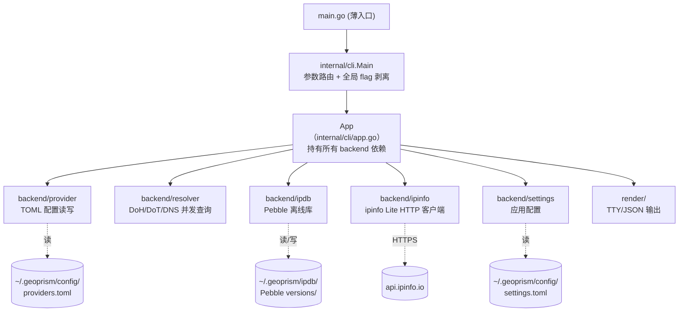

# GeoPrism 架构总入口

## 0. 术语

- **Provider**：DNS 上游服务商（Cloudflare / Google / Quad9 / AliDNS 等）。在代码里是一个 TOML 配置项，携带协议（doh / dot / dns）、端点、端口、超时等。见 `backend/provider/provider.go:30`。
- **离线库 / ipdb**：本地 Pebble 存储，由 ipinfo Lite CSV 导入。单文件 `CURRENT` 指向 `versions/{buildID}/db` 当前激活版本。见 `backend/ipdb/store.go:28`。
- **回退（fallback）**：ipdb 未命中时改走 ipinfo 在线 API，并把结果异步回写 ipdb。见 `internal/cli/ip_merge.go:62`。
- **数据源优先级**：`ipdb-first`（默认）或 `ipinfo-first`，只影响单 IP 主路径的合并策略，不影响 CIDR 查询。见 `backend/settings/settings.go:13`。

## 1. 定位与受众

- 这是整个项目的架构总图——`feature-design` 用来定位要动哪一块、`issue-analyze` 用来理解模块边界、新人上手用来建立心智模型。
- 读完能知道：CLI 怎么把一条命令分发到子命令、各 backend 模块怎么协作、数据落到 `~/.geoprism/` 哪个位置。

## 2. 结构与交互

GeoPrism 是一个**单进程、跑完即退出**的 CLI。所有状态要么在内存里用完即弃，要么落在 `~/.geoprism/` 磁盘上。没有常驻服务、没有网络监听端口（只有出站 DNS / HTTPS）。

**分层原则（为什么这么切）**：

- `main.go` 只做"把 os.Args 交给 cli"——避免业务逻辑污染入口，入口文件任何阶段都不该膨胀。
- `internal/cli/` 是**编排层**：参数解析、子命令分发、把多个 backend 组装成用户可感的结果视图（View）。不直接做网络 / 磁盘 IO，全部委托给 backend。
- `backend/` 是**能力层**：每个子目录是一个独立能力（resolver / provider / ipdb / ipinfo / settings），互不反向依赖。编排层依赖能力层，能力层不依赖编排层——这条方向线不能反转。
- `render/` 是**展示层**：纯输出，只接收 View DTO（实现 `render.*Source` 接口），不知道数据从哪来。

依赖方向（必须单向）：`main → internal/cli → backend/{provider,resolver,ipdb,ipinfo,settings}`；`internal/cli → render`。backend 内部子包之间也尽量解耦，目前 `ipinfo` 为了 `Response.ToRecord()` 反向依赖 `backend/ipdb` 的 `Record` 类型（见 `backend/ipinfo/client.go:27`），是允许的唯一例外，因为 ipinfo 结果天然要表达成 ipdb 的记录格式。

## 3. 数据与状态

**持久化边界**——只有三处在磁盘上，都在 `~/.geoprism/`（路径见 `internal/cli/paths.go:22`）：

| 位置 | 内容 | 谁写谁读 |
|---|---|---|
| `config/providers.toml` | DNS Provider 列表 | 首次启动写默认模板（`backend/provider/provider.go:78`）；之后只读。Upsert/Delete 方法存在但 CLI 暂未暴露写入命令 |
| `config/settings.toml` | ipinfo_token、data_source_priority | 首次启动写默认模板（`backend/settings/settings.go:34`）；之后只读 |
| `ipdb/` | Pebble 离线库（`CURRENT` + `versions/{buildID}/db`） | `ipdb build` 子命令全量重建（`internal/cli/ipdb_cmd.go`）；运行期 ipinfo 回写增量（`internal/cli/ip_merge.go:82`） |

**内存状态**：`App` 结构体（`internal/cli/app.go:19`）持有所有依赖；ipdb Store 用懒加载（`ensureIPDBStore` 首次访问才打开，`internal/cli/app.go:101`），关掉前 `defer Close()`。

**进程外依赖**：ipinfo API（出站 HTTPS，仅当 token 非空）。

## 4. 关键架构决定

- **CLI 用标准库 flag，不上框架**——项目定位是轻量本地工具，依赖越少越好；所有子命令用 `flag.NewFlagSet` 手搓。
- **IP 库选 Pebble 而非 SQLite**——需要大量前缀区间扫描（CIDR 相交），LSM 的有序迭代比 B-Tree 更适合；且 Pebble 是纯 Go，跨平台编译友好。
- **ipinfo 回写异步**——回写不该阻塞用户查询主路径（`internal/cli/ip_merge.go:71` 用 goroutine），失败只打日志不影响输出。
- **CIDR 查询固定走 ipdb 优先，不受 data_source_priority 控制**——CIDR 是"一片网段"的语义，在线 API 没有等价能力；只有 ipdb 完全没命中才以基地址回退单 IP 查询（`internal/cli/cidr_lookup.go:140`）。

> 以上结论尚未单独落档为 `decision`。`TODO: 后续用 cs-decide 把 Pebble 选型 / ipinfo 回写异步 沉淀为 decision`。

## 5. 子系统文档索引

| 文档 | 覆盖范围 | 承载需求 |
|---|---|---|
| [dns-query.md](./dns-query.md) | 多 Provider DNS 查询、Provider 配置与连通性测试、NS zone 探测 | `multi-provider-dns-query` |
| [ip-lookup.md](./ip-lookup.md) | 离线 IP / CIDR 查询、ipinfo 回退与回写、数据源优先级 | `offline-ip-lookup` |

## 6. 已知约束 / 硬边界

- **`backend/` 子包不允许反向 import `internal/cli`**——编排层单向依赖能力层。
- **`providers.json` 不读不迁移**——只认 `providers.toml`；检测到旧 JSON 只打警告（`backend/provider/provider.go:86`）。
- **ipinfo 回写只追加 /32 / /128 记录**——不聚合网段，避免覆盖 CSV 导入的粗粒度数据（`backend/ipinfo/client.go:27`）。
- **ipdb 的 `WriteRecord` 复用运行期打开的 Store 句柄**——回写和查询共享同一 Pebble 句柄，依赖 Pebble 自身的并发安全。

## 7. 代码锚点

| 位置 | 一行说明 |
|---|---|
| `main.go:9` | 程序入口，只调 `cli.Main` |
| `internal/cli/main.go:88` | `Main`：参数路由，分流到 query / ipdb / providers / test 或快捷 IP/CIDR/domain |
| `internal/cli/app.go:19` | `App` 结构体：持有 providerStore / resolver / ipdbStore / ipinfoClient / settings |
| `internal/cli/app.go:37` | `NewApp`：初始化所有依赖，懒加载 ipdb |
| `internal/cli/paths.go:22` | `getAppRootDir`：`~/.geoprism` 路径计算 |
| `backend/resolver/resolver.go:376` | `QueryMulti`：并行多 Provider DNS 查询 |
| `backend/ipdb/store.go:28` | `OpenCurrent`：打开 `CURRENT` 指向的激活版本 |
| `backend/ipdb/store.go:132` | `LookupIP`：单 IP 查询 |
| `backend/ipdb/store.go:198` | `LookupCIDR`：CIDR 相交网段查询 |
| `backend/ipdb/builder.go:34` | `BuildFromCSV`：CSV 导入构建新版本 |
| `internal/cli/ip_merge.go:26` | `mergeIPInfo`：ipdb / ipinfo 合并策略 |
| `internal/cli/ip_merge.go:62` | `maybeWriteBack`：ipinfo 结果异步回写 |
| `backend/ipinfo/client.go:70` | `LookupIP`：ipinfo Lite API 调用 |

## 8. 相关文档

- 承载需求：[多 Provider DNS 查询](../requirements/multi-provider-dns-query.md)、[离线 IP / CIDR 查询](../requirements/offline-ip-lookup.md)
- 子系统：[dns-query.md](./dns-query.md)、[ip-lookup.md](./ip-lookup.md)
