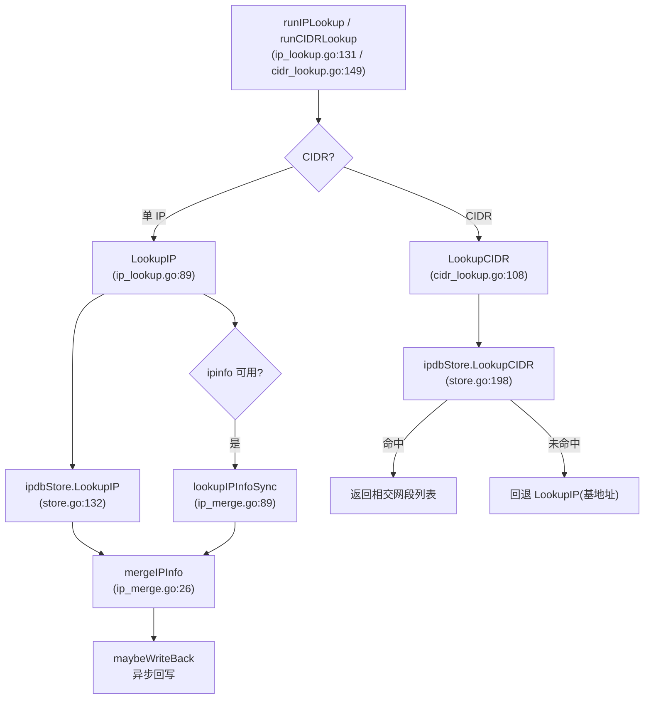

# 离线 IP / CIDR 查询子系统

## 0. 术语

- **ipdb**：Pebble 离线库，存 IP 网段 → 归属信息。见 `backend/ipdb/store.go:19`。
- **Record**：一条归属记录（network + country + asn 等共 8 字段）。见 `backend/ipdb/types.go:20`。
- **Match**：单 IP 查询结果，带 `Matched` 布尔。见 `backend/ipdb/types.go:32`。
- **回写（writeback）**：ipinfo 查到的结果异步写回 ipdb，让下次同 IP 直接命中。见 `internal/cli/ip_merge.go:62`。
- **Source**：结果的数据来源标记（`ipdb` / `ipinfo`），暴露给用户区分可信度。

## 1. 定位与受众

- 覆盖：单 IP 快捷查询、CIDR 快捷查询、`ipdb build` 构建、query 流程里附带的 IP 匹配详情、ipinfo 在线回退与回写。
- `feature-design` 改 IP 查询逻辑、加新数据源、改 CIDR 行为时读本档；`issue-analyze` 排查"某 IP 查不到 / CIDR 漏网段 / 回写失败"时读它。

## 2. 结构与交互



**为什么这么分**：

- **单 IP 和 CIDR 是两条独立路径**——单 IP 是"找覆盖这个 IP 的那一条网段"（最长前缀匹配），CIDR 是"找所有和这片网段相交的网段"（区间扫描）。两者查询语义和 Pebble 迭代方式不同，所以 `LookupIP` / `LookupCIDR` 是 Store 上两个独立方法（`backend/ipdb/store.go:132` / `:198`）。
- **CIDR 路径不调 ipinfo**——CIDR 是"一片网段"语义，ipinfo 只能查单 IP，没有等价能力；所以 CIDR 主路径固定 ipdb 优先，只有完全没命中才以 CIDR 基地址（`prefix.Addr()`）回退到单 IP 流程（`internal/cli/cidr_lookup.go:140`）。这也是为什么 CIDR 不受 `data_source_priority` 控制。
- **合并逻辑集中在 `mergeIPInfo`**——单 IP 流程无论从哪进来（快捷查询 / CIDR 回退 / DNS 结果 IP 匹配）都走同一个合并函数（`internal/cli/ip_merge.go:26`），保证策略一致。

**契约**：

- **懒加载**：`ensureIPDBStore` 首次调用才打开 Pebble（`internal/cli/app.go:101`），失败记 `ErrNoCurrentDatabase` 并设告警文案，不中断主流程。
- **去重**：DNS 结果里同一 IP 多次出现时，ipinfo 只调一次（`internal/cli/ip_match.go:115` 的 `seen` 缓存）；但跨进程不共享。
- **回写条件**：ipdb 未命中 → 直接写；ipdb 命中但 7 个数据字段有差异 → 覆盖写（`internal/cli/ip_merge.go:70`）。

## 3. 数据与状态

**核心类型**：

| 类型 | 定义 | 含义 |
|---|---|---|
| `ipdb.Record` | `backend/ipdb/types.go:20` | 一条归属记录（network / country / asn 等 8 字段） |
| `ipdb.Match` | `backend/ipdb/types.go:32` | 单 IP 查询结果 |
| `ipdb.Metadata` | `backend/ipdb/types.go:39` | 离线库元信息（版本 / 行数 / 构建时间） |
| `ipdb.Store` | `backend/ipdb/store.go:19` | 激活版本的 Pebble 句柄 |
| `ipinfo.Response` | `backend/ipinfo/client.go:14` | ipinfo Lite API 响应 |
| `cli.IPLookupView` | `internal/cli/ip_lookup.go:19` | 单 IP 查询对外视图 |
| `cli.CIDRLookupView` | `internal/cli/cidr_lookup.go:15` | CIDR 查询对外视图 |

**磁盘布局**（`~/.geoprism/ipdb/`）：

```
ipdb/
├── CURRENT                 # 内容是当前激活的 buildID
└── versions/
    └── {buildID}/
        └── db/             # Pebble 数据目录
```

`OpenCurrent` 读 `CURRENT` → 拼 `versions/{buildID}/db` 路径 → 打开 Pebble（`backend/ipdb/store.go:28`）。`BuildFromCSV` 写新版本目录但不切 `CURRENT`——切换由 builder 内部完成（`backend/ipdb/builder.go:34`）。

**Key 编码**：IPv4 / IPv6 用 `0x04` / `0x06` 前缀字节区分 family（`backend/ipdb/types.go:6`），元数据用 `0x00`。具体编码在 `backend/ipdb/codec.go`。

**所有权**：Store 句柄归 `App`，运行期只读 + 回写共用同一句柄；`defer Close()` 在 `Main` 退出时关（`internal/cli/app.go:77`）。

## 4. 关键决策

- **Pebble 而非 SQLite**——CIDR 相交查询是大量前缀区间扫描，LSM 有序迭代比 B-Tree 更适合；纯 Go 依赖跨平台编译友好。
- **ipinfo 回写只写 /32 或 /128**——不聚合粗网段，避免覆盖 CSV 导入的网段级数据（`backend/ipinfo/client.go:27`）。
- **回写异步、失败只 log**——不阻塞用户查询主路径（`internal/cli/ip_merge.go:71` `go a.writeIPInfoRecord(...)`）。
- **CIDR 查询要回看前一条记录**——因为 SeekGE 可能跳过了覆盖查询起点的"大网段"，所以要 `iter.Prev()` 补一刀（`backend/ipdb/store.go:255`）。

> 以上尚未单独落档为 `decision`。`TODO: 后续用 cs-decide 把 ipinfo 回写策略 / Pebble 选型 沉淀为 decision`。

## 5. 代码锚点

| 位置 | 一行说明 |
|---|---|
| `internal/cli/ip_lookup.go:89` | `LookupIP`：单 IP 主流程（ipdb → ipinfo → 合并 → 回写） |
| `internal/cli/ip_lookup.go:131` | `runIPLookup`：快捷 IP 查询入口 |
| `internal/cli/cidr_lookup.go:108` | `LookupCIDR`：CIDR 主流程（ipdb 区间扫描，未命中回退单 IP） |
| `internal/cli/cidr_lookup.go:149` | `runCIDRLookup`：快捷 CIDR 查询入口 |
| `internal/cli/ip_match.go:101` | `collectIPMatches`：DNS 结果里 A/AAAA 记录的 IP 匹配（带去重） |
| `internal/cli/ip_merge.go:26` | `mergeIPInfo`：ipdb / ipinfo 合并策略（受 priority 控制） |
| `internal/cli/ip_merge.go:62` | `maybeWriteBack`：回写决策（未命中直写 / 有差异覆盖） |
| `internal/cli/ip_merge.go:82` | `writeIPInfoRecord`：异步回写执行 |
| `internal/cli/ip_merge.go:89` | `lookupIPInfoSync`：同步调 ipinfo，5s 超时 |
| `internal/cli/app.go:101` | `ensureIPDBStore`：懒加载 + 错误归类 |
| `internal/cli/app.go:122` | `hasIPInfoLookup`：是否可走 ipinfo（client 或测试注入非空） |
| `backend/ipdb/store.go:28` | `OpenCurrent`：打开 CURRENT 指向的激活版本 |
| `backend/ipdb/store.go:85` | `WriteRecord`：运行期增量回写入口 |
| `backend/ipdb/store.go:132` | `LookupIP`：单 IP 查询（前缀迭代） |
| `backend/ipdb/store.go:198` | `LookupCIDR`：CIDR 相交网段查询（区间迭代） |
| `backend/ipdb/store.go:304` | `prefixesOverlap`：两网段是否相交 |
| `backend/ipdb/builder.go:34` | `BuildFromCSV`：CSV → Pebble 新版本 |
| `backend/ipdb/codec.go` | key / value 编解码（前缀字节 + 地址） |
| `backend/ipinfo/client.go:27` | `Response.ToRecord`：ipinfo 响应 → ipdb Record（固定 /32 或 /128） |
| `backend/ipinfo/client.go:70` | `LookupIP`：ipinfo Lite API 调用 |
| `backend/settings/settings.go:77` | `DataSourcePriority`：读取优先级配置 |

## 6. 已知约束 / 边界情况

- **ipdb Store 懒加载、失败不中断**：`ensureIPDBStore` 打开失败只设告警（`internal/cli/app.go:117`），主流程继续；只有单 IP / CIDR 查询且 ipinfo 也不可用时才报错退出（`internal/cli/ip_lookup.go:112`）。
- **回写和查询共享同一 Pebble 句柄**：依赖 Pebble 自身并发安全；回写用 `WriteRecord`（`backend/ipdb/store.go:85`），不另开句柄。
- **CIDR 查询的 `prefixesOverlap` 要求两网段同 family**：IPv4 / IPv6 不互相匹配（`backend/ipdb/store.go:311`）。
- **ipinfo token 为空时整层兜底关闭**：`hasIPInfoLookup` 返回 false（`internal/cli/app.go:122`），`collectIPMatches` 和 `LookupIP` 都跳过 ipinfo 分支。
- **`ipinfoLookup` 字段可被测试注入**：`App.ipinfoLookup func(string) *ipinfo.Response`（`internal/cli/app.go:33`）允许测试替换真实 HTTP 调用——改这块逻辑时注意别破坏测试钩子。
- **`-j` 在 ipdb build 时被忽略并警告**：`ipdb` 不在 `jsonSupportedCommands` 里（`internal/cli/main.go:59`）。

## 7. v2 收口状态（2026-06-22，ipdb-v2-query 落地）

本节标注 ipdb-v2-lpm roadmap 最小闭环（ipdb-v2-query）落地后，本文档与代码的已知脱节。
**§1–§6 仍是止血前/v1 的描述**，完整重写留给 `ipdb-lookup-integration`（届时 `Store` 过渡壳拆除、`App` 改持 `*BaseStore`/`*OverlayStore`、`WriteRecord` 删除）。读者请以本节为准判断当前真实行为。

**已落地的系统级变化**：
- 公开 `BuildFromCSV` 委托 v2 builder（`backend/ipdb/builder.go`），产出 v2 格式库（primary/cidr 双索引 + base value v2 + `FormatVersion=2` + `SchemaFeatures=PrimaryLPM|CIDRStartIdx`）。
- 公开 `OpenCurrent`（`backend/ipdb/store.go`）打开 v1 库返回 `ErrLegacyFormat`、缺 capability 返回 `ErrIncompleteSchema`；v2 库经 `BaseStore`（`backend/ipdb/store_v2.go`）做真查询。
- `Store`（`backend/ipdb/store.go`）现为**过渡壳**：内部持 `*BaseStore`，`LookupIP`/`LookupCIDR` 转 v2 真 LPM / 三段 CIDR；`WriteRecord` 改为显式返回只读错误。cli 5 调用点签名零 diff。
- 真 LPM ladder（单 IP 逐前缀长度 point Get）+ CIDR 三段查询（ancestors 精确 Get + self + descendants 区间扫描）已取代 v1 近似算法；`LookupCIDR` 按 `encodeCIDRKeyV2` 字节序确定性排序。
- `currentFormatVersion` 升到 2。

**本文档与代码的脱节（待 integration 重写，勿据此判断现状）**：
- §2 mermaid / §5 代码锚点仍描述 v1 `Store.LookupIP`(SeekGE+prev)/`LookupCIDR`(Prev回看)/`WriteRecord`/单索引 `0x04/0x06`——实际已切 v2 真 LPM / 三段 CIDR / 过渡壳 / 双索引 `0x14/0x16/0x24/0x26`。
- §4"CIDR 查询要回看前一条记录"已被三段查询取代。
- §6"回写和查询共享同一 Pebble 句柄"——v2 base 已 ReadOnly，回写目标改为（未来的）overlay（`ipdb-overlay-store` 未落地前运行期回写已全部停用）。

详细设计见 `.codestable/features/2026-06-22-ipdb-v2-query/` 与 roadmap `.codestable/roadmap/ipdb-v2-lpm/`。

## 8. 相关文档

- 上层：[ARCHITECTURE.md](./ARCHITECTURE.md)
- 承载需求：[离线 IP / CIDR 查询](../requirements/offline-ip-lookup.md)
- 配套子系统：[dns-query.md](./dns-query.md)（query 流程通过 `collectIPMatches` 调用本子系统的 IP 匹配能力）
