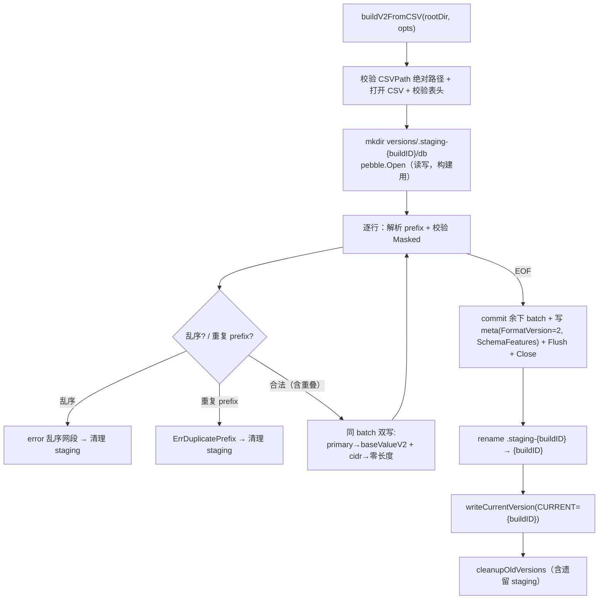

# ipdb-v2-base-build design

## 0. 术语约定

新增符号已 grep 全仓（代码 + 架构 + 历史 feature），仅在 roadmap/decision 文档出现，**无代码冲突**（`grep -rn "buildV2FromCSV\|openBaseV2\|BaseStore\|ErrDuplicatePrefix\|formatVersionV2\|staging" backend/ internal/` 当前为空）。

| 术语 | 定义 | 来源 |
|---|---|---|
| `buildV2FromCSV` | v2 base 构建**内部入口**：同 batch 双写 primary+cidr、staging 原子构建、重复 prefix reject | 本 feature 新增 `backend/ipdb/builder_v2.go` |
| `openBaseV2` | v2 base **内部打开入口**：按 rootDir+buildID 拼 dbDir 后 ReadOnly 打开 + 读 metadata，返回 `*BaseStore` | 本 feature 新增 `backend/ipdb/store_v2.go` |
| `BaseStore` | v2 不可变 base 库句柄（ReadOnly）；本 feature 只承载 metadata 读取与 Close，**不含查询方法** | 本 feature 新增；`LookupIP/LookupCIDR` 归 `ipdb-v2-query` |
| `formatVersionV2` | v2 库 `Metadata.FormatVersion` 取值 = 2 的新常量；**`currentFormatVersion` 保持 1 不动** | 本 feature 新增 `types.go` |
| `ErrDuplicatePrefix` | 同 family 内 `Masked()` 后完全相同 prefix → 构建失败 | 本 feature 新增；decision `ipdb-base-reject-duplicate-prefix` |
| staging 目录 | `versions/.staging-{buildID}/db`，构建中目录；关库后 rename 为 `versions/{buildID}/db` 再切 CURRENT | roadmap §4.6 |
| primary/cidr 双索引 | 每条逻辑记录写两个 key：primary（canonical value）+ cidr（零长度 value），同一 batch | decision `ipdb-cidr-index-empty-value` |

## 1. 决策与约束

### 需求摘要

- **做什么**：实现 v2 base 库的**构建与打开**能力，但以**内部入口**形式存在、不接生产路径。构建：从 CSV 同 batch 双写 primary + cidr 双索引、base value v2、staging 目录原子构建、相同 prefix 严格 reject、允许不同 prefix 重叠。打开：`BaseStore` 以 Pebble `ReadOnly` 打开并读出 metadata。
- **为谁**：roadmap 后续 `ipdb-v2-query`——它在收口处把这两个内部入口接到公开 `BuildFromCSV`/`OpenCurrentBase` 并加查询逻辑，原子切到 v2。
- **成功标准**（均可观察）：
  1. `buildV2FromCSV` 产出库中 `primaryCount == cidrCount == Metadata.RowCount`（双索引同 batch 原子写）；
  2. `Metadata.FormatVersion == 2` 且 `SchemaFeatures == SchemaFeaturePrimaryLPM|SchemaFeatureCIDRStartIdx`；
  3. 输入含完全相同 prefix → `ErrDuplicatePrefix`（含规范 prefix + 首次行号 + 重复行号），不留正式版本目录；
  4. 输入含不同 prefix 重叠（如 `10.0.0.0/8`+`10.0.0.0/16`+`10.1.0.0/16`）→ 构建成功；
  5. `openBaseV2` 能 ReadOnly 打开产出库并读出 metadata；对该句柄写入失败（ReadOnly 生效）；
  6. 构建中间态在 `.staging-{buildID}`，成功后只剩 `{buildID}`、失败不留正式目录。
- **明确不做**：
  - 不实现 `BaseStore.LookupIP` / `LookupCIDR`（真 LPM ladder / 三段查询归 `ipdb-v2-query`）；
  - 不定义/使用 `ErrLegacyFormat` / `ErrIncompleteSchema` / `ErrCorruptIndex`（capability 拒绝、v1 重建提示、索引完整性校验归 query / integration）；
  - 不切换公开 `BuildFromCSV` / `OpenCurrent`，不改 `currentFormatVersion`（仍 1）；
  - 不碰 `internal/cli/*`（无生产调用方接入）；
  - 不做 overlay（归 `ipdb-overlay-store`）。

### 复杂度档位

走默认档位（库存储层 / 纯 Go / 单进程构建 IO / 未激活无对外行为变化），无偏离信号。

### 关键决策

每条换种做法名词层或编排层会变得不同；其中 D1/D2 是 base-build↔query 边界划分，roadmap 已给倾向，此处显式拍板，review 时可一次性反驳：

1. **`formatVersionV2 = 2` 独立常量，`currentFormatVersion` 不动**。→ v2 库 metadata 必须标 `FormatVersion=2`+`SchemaFeatures` 供 query 阶段 `OpenCurrentBase` 识别；但公开 v1 路径与 `currentFormatVersion` 在 query 收口前零变化，故不能复用 `currentFormatVersion` 常量。
2. **（D1）`openBaseV2` 只做 ReadOnly 打开 + 读 metadata + sanity 校验 `FormatVersion==2`**，**不**做 `SchemaFeatures` capability 拒绝、**不**做 v1 识别。→ roadmap §4.3 把 `ErrLegacyFormat`/`ErrIncompleteSchema` 归 `OpenCurrentBase`（query）；base-build 内部入口喂进来的就是自家 `buildV2FromCSV` 刚产出的 v2 库，无需 v1 识别。query 阶段 `OpenCurrentBase(rootDir)` 读 CURRENT 得 buildID 后调 `openBaseV2(rootDir, buildID)`，再叠加 capability 拒绝，零改动复用（openBaseV2 持有 rootDir/buildID/dbDirPath，query 无需重新补状态）。
   - **错误形态**：sanity 校验失败返回 `fmt.Errorf` 包装错误（**非 sentinel**）——"版本不对/无 metadata"在 base-build 不需要被调用方按类型区分。query 阶段若需区分"打不开"vs"是 v1 库"以输出重建提示，由 `OpenCurrentBase` 引入 `ErrLegacyFormat` sentinel；本 feature 不预先定义。
3. **（D2）`buildV2FromCSV` 走完整 staging→rename→切 CURRENT 全流程**（在调用方给的 rootDir，仅测试临时目录）。→ roadmap §4.6 注释明示"rename 为正式目录再切 CURRENT"；完整复刻最终行为，query 收口时 `buildV2FromCSV` 直接成为公开 `BuildFromCSV` 主体、零改动。"未激活"指**无生产调用方**（仅测试调用），不指"半截流程"。
4. **保留"每个 family 内起始地址非递减"输入契约（乱序 reject）**，但**删除 v1 的 overlap reject**，新增 duplicate-prefix reject。→ decision `ipdb-base-reject-duplicate-prefix` §5：有序仅作输入契约 + 性能优化，不再是查询正确性前提；重叠交由真 LPM/CIDR 处理；重复判定比较**完整 prefix**（primary key）而非仅起始地址。
5. **复用现有 CSV 解析/校验/family 统计/`prefixLastAddr`/`cleanupOldVersions`/`writeCurrentVersion`**，v2 builder 只替换"key/value 编码 + 双写 + 去重/重叠策略 + staging 目录"。→ 换成另起一套 CSV 解析会与 v1 行为漂移，且增维护面。

### 前置依赖

`ipdb-v2-schema`（done）：types.go 的 kind 字节 / `SchemaFeatures` / `Metadata.SchemaFeatures` / `OverlayMeta`，codec.go 的 `encodePrimaryKeyV2` / `encodeCIDRKeyV2` / `encodeBaseRecordValueV2` 等全部就绪，本 feature 直接调用。

## 2. 名词与编排

### 2.1 名词层

#### 现状

| 符号 | 位置 | 职责 |
|---|---|---|
| `BuildFromCSV` | `builder.go:34` | v1 构建：单索引 `encodePrefixKey`、value 含 prefixLen、有序+**重叠 reject**、直接写 `versions/{buildID}/db`、切 CURRENT |
| `Store` / `OpenCurrent` | `store.go:19/28` | v1 读写句柄（非 ReadOnly），含 `WriteRecord`/`LookupIP`/`LookupCIDR` |
| `prefixLastAddr` / `writeCurrentVersion` / `cleanupOldVersions` | `builder.go:280/252/265` | family 区间末尾 / 原子写 CURRENT / 清理旧版本（可复用） |
| `formatVersionV2` / `ErrDuplicatePrefix` / `BaseStore` | — | **不存在** |
| v2 codec（10 函数）+ kind 常量 + `SchemaFeatures` + `Metadata.SchemaFeatures` | `codec.go` / `types.go` | 已就绪（schema），**本 feature 不改** |

#### 变化

**`types.go`（新增常量，不改现有）**：
- `formatVersionV2 byte = 2`（v2 库 metadata 版本；`currentFormatVersion` 不动）
- 可选：`stagingDirPrefix = ".staging-"`（staging 目录名前缀）

**`store_v2.go`（新增文件）**：
```go
var ErrDuplicatePrefix = errors.New("base 构建出现重复 prefix")   // 或置于 builder_v2.go，二选一

type BaseStore struct {
    rootDir, buildID, dbDirPath string
    db        *pebble.DB     // ReadOnly 打开
    metadata  Metadata
}
func openBaseV2(rootDir, buildID string) (*BaseStore, error)  // 拼 rootDir/versions/{buildID}/db 后 ReadOnly 打开 + 读 metadata + sanity FormatVersion==2
func (s *BaseStore) Metadata() Metadata
func (s *BaseStore) Close() error
// 本 feature 不加 LookupIP / LookupCIDR
```

**`builder_v2.go`（新增文件）**：
```go
func buildV2FromCSV(rootDir string, opts BuildOptions) (Metadata, error)
// CSV 解析复用 v1 逻辑；每行同 batch 双写：
//   batch.Set(encodePrimaryKeyV2(p), encodeBaseRecordValueV2(rec))
//   batch.Set(encodeCIDRKeyV2(p),    []byte{})        // 零长度 value
// duplicate-prefix reject（比较完整 prefix）；删除 overlap reject；保留乱序 reject
// 构建到 versions/.staging-{buildID}/db → 关库 → rename 到 versions/{buildID}/db → 切 CURRENT
// meta.FormatVersion = formatVersionV2；meta.SchemaFeatures = SchemaFeaturePrimaryLPM|SchemaFeatureCIDRStartIdx
```

**不改**：`BuildFromCSV` / `Store` / `OpenCurrent` / `WriteRecord` / `currentFormatVersion` / 全部 v1 与 v2 codec。

#### 接口示例

```
buildV2FromCSV(rootDir, {CSVPath, BuildID:"b1"})
  输入 CSV：10.0.0.0/8 / 10.0.0.0/16 / 10.1.0.0/16   （不同 prefix 重叠，合法）
  → Metadata{FormatVersion:2, RowCount:3, IPv4Count:3, SchemaFeatures: primary|cidr}
  → 磁盘：versions/b1/db（含 3 primary key + 3 cidr key）；CURRENT="b1"

buildV2FromCSV  输入含  10.0.0.0/8 (行42) … 10.0.0.0/8 (行128)
  → error "CSV 第 128 行出现重复网段 10.0.0.0/8，首次出现于第 42 行"（ErrDuplicatePrefix）
  → 不存在 versions/b1/db，不存在 CURRENT

openBaseV2(rootDir, "b1")   // 内部拼 rootDir/versions/b1/db
  → *BaseStore{rootDir, buildID:"b1", dbDirPath, metadata:{FormatVersion:2, SchemaFeatures: primary|cidr, ...}}
  store.db.Set(...)  → error（ReadOnly）
```

### 2.2 编排层

本 feature 引入一条构建编排（`buildV2FromCSV`）+ 一个轻量打开（`openBaseV2`）。打开侧无编排（线性：ReadOnly Open → Get meta → sanity）。构建侧主流程：



#### 现状

v1 `BuildFromCSV` 为单索引线性构建：`encodePrefixKey`（仅 masked 起始地址）+ `encodeRecordValue`（含 prefixLen），per-family `prevStart/prevEnd` 做有序 + **重叠 reject**，直接写 `versions/{buildID}/db` 后切 CURRENT，无 staging。

#### 变化

新增**并行的 v2 构建编排**（v1 不动）。拓扑差异：① 每行从单 `batch.Set` 变**同 batch 双 `Set`**（primary + cidr）；② 重叠 reject 删除、改 duplicate-prefix reject；③ 构建目标改 `.staging-{buildID}`，关库后 rename 再切 CURRENT（原子化）；④ meta 写 `FormatVersion=2` + `SchemaFeatures`。`openBaseV2` 与 v1 `OpenCurrent` 的差异：Pebble `ReadOnly:true` 打开、接受 rootDir+buildID 自拼 dbDir（而非读 CURRENT，CURRENT 读取归 query 的 `OpenCurrentBase`）。

#### 流程级约束

- **双索引原子性**：primary 与 cidr 必须写入**同一个 batch**；构建不变量 `primaryCount == cidrCount == RowCount`（decision `ipdb-cidr-index-empty-value`）。沿用 v1 的 `batchCommitSize=10000` 分批 commit，但**同一行的 primary+cidr 两个 Set 不得跨 batch 边界拆开**（即 commit 切点只能落在"行与行之间"，不能落在"一行的 primary 与 cidr 之间"）。为可测此硬条件，commitSize 需**可注入**（包级 `var` 或 `BuildOptions` 新增字段，implement 自决），让单测用极小 commitSize 触发行边界=batch 边界。
- **staging 原子性**：任何错误路径（解析失败 / reject / 写库失败）都不得留下 `versions/{buildID}/db` 正式目录与 CURRENT 指向；`.staging-{buildID}` 在失败时清理（成功时 rename 消失）。
- **CURRENT 切换在关库 + rename 之后**：保证 CURRENT 永远指向一个已 Flush 关闭的完整目录。
- **duplicate 判定语义**：同 family 内、`Masked()` 后完全相同的 `netip.Prefix`（= 相同 primary key）为重复；相同起始地址 + 不同 prefixLen 合法；不同 prefix 重叠合法。错误信息含规范 prefix + 首次行号 + 重复行号。
- **base ReadOnly**：`openBaseV2` 用 `pebble.Options{ReadOnly:true, Logger:silentLogger{}}`；`BaseStore` 不提供任何写方法（decision `ipdb-base-readonly-writeback-to-overlay`）。
- **family 统计**：`IPv4Count`/`IPv6Count` 按记录数（每条记录一次，与 primary 计数同源），`RowCount = IPv4Count + IPv6Count = primaryCount = cidrCount`。

### 2.3 挂载点清单

**本 feature 不引入用户/系统可见挂载点**。判据：删掉 `buildV2FromCSV` / `openBaseV2` / `BaseStore`，feature 在用户/系统视角是否消失？——本 feature 二入口**无任何生产调用方**（仅测试调用），公开 `ipdb build` / 查询路径全程走 v1，对用户完全不可见。挂载点在 `ipdb-v2-query` 收口（公开 `BuildFromCSV`/`OpenCurrentBase` 切到 v2）时才产生，归该 feature。

这与 schema feature 同构——"未激活地基"的本意即无挂载点；若此处冒出可见挂载点，反而说明误接了生产路径。

### 2.4 推进策略

按 paradigm 维度切片（持久化类型 → 构建计算 → 持久化原子化 → 打开 → 测试）：

1. **常量与错误类型**：`types.go` 加 `formatVersionV2`（+ 可选 staging 前缀常量）；定义 `ErrDuplicatePrefix`。
   退出信号：`go build ./...` 通过；`grep currentFormatVersion types.go` 仍为 `byte = 1`。
2. **v2 builder 核心（双写 + 去重）**：`builder_v2.go` 实现 `buildV2FromCSV`，复用 CSV 解析，同 batch 双写 primary+cidr、base value v2、duplicate reject、删 overlap reject、保留乱序 reject、写 meta(FormatVersion=2+SchemaFeatures)；commitSize 改可注入。先直写 `versions/{buildID}/db`（暂不 staging）跑通主路径。
   退出信号：临时测试调 `buildV2FromCSV` 后，直接扫 Pebble 统计 primaryCount==cidrCount==RowCount；不同 prefix 重叠构建成功；相同 prefix 返回 `ErrDuplicatePrefix`；**注入极小 commitSize 时双索引仍 primaryCount==cidrCount==RowCount（行边界=batch 边界不拆双写）**。
3. **staging 原子化**：构建目标改 `.staging-{buildID}/db`，关库后 rename 到 `{buildID}/db` 再切 CURRENT；所有错误路径清理 staging；`cleanupOldVersions` 兼顾遗留 staging。
   退出信号：构建中存在 `.staging-{buildID}`、成功后只剩 `{buildID}` 且 CURRENT 指向它；失败路径下 `versions/{buildID}` 与 CURRENT 均不存在。
4. **BaseStore + openBaseV2**：`store_v2.go` 实现 ReadOnly 打开 + 读 metadata + `FormatVersion==2` sanity；`Metadata()` / `Close()`。
   退出信号：`openBaseV2` 打开 step3 产出库读出 `FormatVersion=2`、`SchemaFeatures=primary|cidr`；对句柄写入失败（ReadOnly 生效）。
5. **测试收口**：补齐 roadmap §7 base-build 验收矩阵（见第 3 节）；跑质量三件套。
   退出信号：第 3 节关键场景均有可观察证据；`go vet ./...` + `gofmt -l` + `git diff --check` + `go test ./backend/ipdb/...` 全绿。

### 2.5 结构健康度与微重构

评估前已查 compound（关键词"目录组织 / 文件归属 / 命名约定"，category=convention）：无命中 convention。

#### 评估

- **文件级 — `backend/ipdb/builder.go`**：当前约 348 行。本次 v2 builder 新逻辑**默认落新文件** `builder_v2.go`（约 +200~250 行——含完整 CSV 循环体、双 Set、去重状态+行号、staging 创建/关库/rename/切 CURRENT、错误路径清理），`builder.go` 仅被复用（不改）。两文件均 < 500 行、职责清晰（v1 / v2 构建）。健康。
- **文件级 — `backend/ipdb/store.go`**：当前约 317 行。`BaseStore`/`openBaseV2` 落新文件 `store_v2.go`（约 +60~80 行），`store.go` 不改。健康。
- **目录级 — `backend/ipdb/`**：现有 9 文件（含 4 测试）。本次新增生产 2（`builder_v2.go`/`store_v2.go`）+ 测试 1~2 → 12~13 文件。单一 package、按"职责 × 版本"切分，命名与既有 `codec_v2_test.go`/`types_v2_test.go` 一致（`*_v2*`）。不摊平。

#### 结论：不做微重构

- v1 文件健康、不改动；v2 新逻辑放新文件是"新逻辑默认放新文件"的常规组织，**非"只搬不改"的搬移**（没有移动现有定义），不构成微重构步骤。
- 目录不挤；`*_v2.go` 命名延续 schema feature 既有约定，无需新立 convention。
- 故 checklist 第 1 步为常规实现步骤（常量/错误类型），无独立微重构前置。

#### 超出范围的观察（仅提示不阻塞）

- 若 query 阶段 `BaseStore` 叠加 `LookupIP/LookupCIDR` 后 `store_v2.go` 超 500 行，届时可走 `cs-refactor` 拆 `base_store.go`（纯文件移动，编译器绿灯）。本 feature 不动。
- v1 `Store.WriteRecord` 在 roadmap 终态由 `ipdb-lookup-integration` 删除；本 feature**不动**（公开入口未切换，删除会破坏 cli 现有调用）。仅记观察。

## 3. 验收契约

每条 = 触发 → 期望可观察结果。覆盖 roadmap §7 base-build 行。

**正常路径**：
1. `buildV2FromCSV` 含 IPv4+IPv6 多行 → `Metadata{FormatVersion:2, RowCount:N, IPv4Count+IPv6Count==N, SchemaFeatures==SchemaFeaturePrimaryLPM|SchemaFeatureCIDRStartIdx}`。
2. **双索引同 batch 原子性**：产出库直接扫 Pebble，primary kind（0x14/0x16）key 数 == cidr kind（0x24/0x26）key 数 == `RowCount`；每个 cidr key value 长度为 0。
3. **primary↔cidr 同源**：任取一条，`decodeCIDRKeyV2(cidrKey)` 与 `decodePrimaryKeyV2(primaryKey)` 还原出同一 `netip.Prefix`；primary value 经 `decodeBaseRecordValueV2` 得正确业务字段（Network 为空，待 query 回填）。
4. `buildV2FromCSV` 接受**单 IP 行**（如 `1.7.168.172` → /32、`2001:db8::1` → /128），family 统计正确。
5. `openBaseV2(rootDir, buildID)` 打开产出库 → `BaseStore` 正确填充 `rootDir/buildID/dbDirPath`；`Metadata()` 返回 `FormatVersion=2` + 正确 `SchemaFeatures`；`Close()` 幂等（二次 Close 不 panic）。
6. **（C）双写不跨 batch 边界**：注入极小 commitSize（如 2），使 commit 切点落在行边界上 → 产出库仍满足 `primaryCount==cidrCount==RowCount`（同一行的 primary+cidr 未被拆到不同 batch 而出现计数不等或半写）。

**边界 / 重叠**：
7. 不同 prefix 重叠输入 `10.0.0.0/8` + `10.0.0.0/16` + `10.1.0.0/16` → 构建**成功**，3 条 primary + 3 条 cidr（验证已删除 v1 overlap reject）。
8. 相同起始地址、不同 prefixLen（`10.0.0.0/8` + `10.0.0.0/16`）→ **不**判重复，成功。
9. `/0`、`/32`、`/128` 边界 prefix 可正常 encode 入库（依赖已就绪 v2 codec）。

**错误路径**：
10. 完全相同 prefix（`10.0.0.0/8` 行 a 与行 b）→ `ErrDuplicatePrefix`，错误信息含规范 prefix + 首次行号 + 重复行号；构建中止后 `versions/{buildID}` 与 CURRENT 均**不存在**。
11. 同 family 内乱序起始地址 → 返回乱序错误（保留 v1 输入契约）；同样不留正式目录 / CURRENT。
12. CSV 表头不符 / network 非规范网段（带 host bits）/ 相对路径 CSVPath → 各自明确 error（复用 v1 校验语义）。
13. **（A）IPv4-mapped IPv6 行**：CSV 含 `::ffff:10.0.0.0/112` 这类在 v1 `parseNetworkField` 合法、但 v2 `encodePrimaryKeyV2`/`validatePrefixV2` 拒绝（codec.go:187）的网段 → 构建失败、不留正式目录 / CURRENT（v2 builder 把 codec 的 family 二义拒绝向上传播，而非静默跳过）。
14. **（B）staging 失败清理**：构建过程注入失败（如非法行 / reject）后，**本次构建必须清理** `versions/.staging-{buildID}`，`versions/{buildID}` 与 CURRENT 均不存在；仅进程 crash 这类非正常退出场景才由**下次构建**的 `cleanupOldVersions` 兜底清理遗留 staging（即"靠兜底"不是正常错误路径的退路）。
15. **ReadOnly 写失败**：`openBaseV2` 句柄上执行 `db.Set` → 返回 error（验证 base 运行期只读，decision `ipdb-base-readonly-writeback-to-overlay`）。
16. **（D）`openBaseV2` 打开空 Pebble 目录**（无 metadata key）→ 返回 `fmt.Errorf` 错误（读 metadata 失败），不 panic。
17. **（D）`openBaseV2` 打开 v1 格式目录**（metadata `FormatVersion != 2`）→ 返回 `fmt.Errorf` sanity 错误（版本不符），不 panic、非 sentinel。

**明确不做的反向核对项**：
18. `grep -n "currentFormatVersion" backend/ipdb/types.go` 仍为 `currentFormatVersion byte = 1`。
19. `git diff backend/ipdb/builder.go backend/ipdb/store.go` 为空（v1 构建/打开零改动）；公开 `BuildFromCSV`/`OpenCurrent`/`WriteRecord` 签名零 diff。
20. `git diff internal/` 为空（cli 无改动，无生产调用方接入 v2）。
21. `grep -rn "func (s \*BaseStore) LookupIP\|LookupCIDR" backend/ipdb/` 为空（查询逻辑未在本 feature 实现）。
22. 代码中无 `ErrLegacyFormat` / `ErrIncompleteSchema` / `ErrCorruptIndex` 的定义或使用（归后续 feature）。

**质量门（项目硬约束，来源 `.codestable/attention.md`）**：Go 改动后必须跑全 `go vet ./...` + `gofmt -l` + `git diff --check`，任一不过不准合并；`go test ./backend/ipdb/...` 全绿（含 v1 回归）。

## 4. 与项目级架构文档的关系

本 feature 改动局限在 `backend/ipdb` **内部**，二入口无生产调用方，**无系统级可见变化**。acceptance 核实后跳过 architecture 归并——与 roadmap §8 观察项一致（`ip-lookup.md` 的 v2/staging/ReadOnly/双索引描述留给 `ipdb-lookup-integration` 的 `cs-feat-accept` 统一回写）。

- 新文件 `builder_v2.go` / `store_v2.go`、staging 布局、双索引、`ReadOnly` 打开均为模块内部协议，待 query 收口切公开入口后才系统级可见。
- `formatVersionV2` / `BaseStore` 是 base 库内部契约；待 query 的 `OpenCurrentBase` 对外暴露 `ErrLegacyFormat`/`ErrIncompleteSchema` 时再回写 arch"已知约束"。
