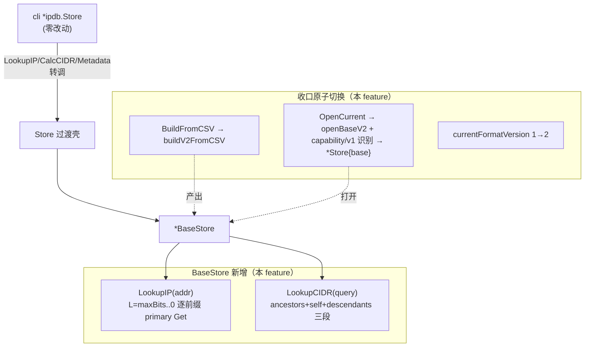

# ipdb-v2-query design

## 0. 术语约定

新增符号已 grep 全仓（代码 + 架构 + 历史 feature + compound），仅在 roadmap / decision / 前两个 feature 文档出现，**无代码冲突**（`grep -rn "ErrLegacyFormat\|ErrIncompleteSchema\|ErrCorruptIndex\|OpenCurrentBase\|ladderAncestors\|ladderLPM" backend/ internal/` 当前为空）。

| 术语 | 定义 | 来源 |
|---|---|---|
| 真 LPM ladder | 单 IP 查询：从 `maxBits(addr)` 递减到 0，逐前缀长度对 primary key 做 point Get，首个命中即最长前缀 | roadmap §4.3；本 feature `store_v2.go` |
| 三段 CIDR 查询 | ancestors（primary 精确 Get `L=0..query.Bits()-1`）+ self（cidr key == query）+ descendants（cidr 起始地址区间扫描 + `prefixLen>=query.Bits()` 过滤） | roadmap §4.3 |
| `OpenCurrentBase` | roadmap §4.3/§4.5 原规划的收口公开打开入口（返 `*BaseStore`）。**本 feature 经用户决策调整**：query 收口用过渡壳 `Store` 转调 `BaseStore`、`OpenCurrent` 公开签名零变化，`OpenCurrentBase` 名字与 `*BaseStore` 对 cli 的直接暴露一并推迟到 `ipdb-lookup-integration`（届时拆 `Store`、`App` 改持 `*BaseStore`/`*OverlayStore`）。**这是对 roadmap §4.3 契约的有意识调整**，见 §1.D2 与"roadmap 契约偏离说明" | 用户决策（见 §1.D2） |
| `ErrLegacyFormat` | `OpenCurrent` 打开的库 `FormatVersion != 2` → sentinel，提示重建 | roadmap §4.3 / §4.5；本 feature `store_v2.go` |
| `ErrIncompleteSchema` | v2 库 `SchemaFeatures` 缺 `PrimaryLPM\|CIDRStartIdx` → sentinel，提示重建 | roadmap §4.3 / §4.5；本 feature `store_v2.go` |
| `ErrCorruptIndex` | cidr key 存在但对应 primary key 不存在 → sentinel，不静默跳过 | decision `ipdb-cidr-index-empty-value` §3；本 feature `store_v2.go` |
| 过渡壳 `Store` | `Store` 内部持有 `*BaseStore`，`LookupIP/LookupCIDR/Metadata` 转调 v2 真查询；`WriteRecord` 本 feature **不删**（归 integration）；cli 5 个调用点签名零 diff | 用户决策（见 §1.D2） |

## 1. 决策与约束

### 需求摘要

- **做什么**：① 给 `BaseStore` 加 `LookupIP`（真 LPM ladder）+ `LookupCIDR`（ancestors+self+descendants 三段）；② **收口原子切换**——公开 `BuildFromCSV` 改调 `buildV2FromCSV`、`OpenCurrent` 改调 `openBaseV2` + capability/v1 拒绝、`currentFormatVersion` 从 1 升到 2；③ `Store` 作过渡壳内部转调 `BaseStore`，cli 零改动；④ property test（暴力 oracle）+ benchmark。
- **为谁**：roadmap 最小闭环——做完后 `geoprism ipdb build` 产出 v2 库，单 IP 查询对"被大网段覆盖 + 同时存在更具体重叠记录"返回正确最长前缀，CIDR 查询返回全部相交网段（含多层祖先）。这是 roadmap 的核心正确性目标，端到端可验证。
- **成功标准**（均可观察）：
  1. `geoprism ipdb build --csv X` 产出库 `Metadata.FormatVersion==2` 且 `SchemaFeatures==PrimaryLPM|CIDRStartIdx`；
  2. 库含 `10.0.0.0/8`+`10.1.0.0/16`+`10.1.2.0/24` 时，`LookupIP("10.1.2.3")` 命中 `10.1.2.0/24`（最长前缀），不被任何更粗网段遮蔽；
  3. 库含 `10.0.0.0/8`+`10.1.0.0/16` 时，`LookupCIDR("10.1.2.0/24")` 返回**两条**（`/8` 与 `/16`，多层祖先），v1 单次 `Prev()` 会漏 `/8`；
  4. `OpenCurrent` 打开 v1 库 → `ErrLegacyFormat`；打开缺 capability 的 v2 库 → `ErrIncompleteSchema`；
  5. `currentFormatVersion` grep 为 `byte = 2`；
  6. cli 5 个调用点（`app.go:111`/`ip_lookup.go:99`/`cidr_lookup.go:122`/`ip_match.go:146`/`ns_info.go:460`）签名零 diff，行为对用户透明升级；
  7. property test：随机 prefix 集 + 暴力 oracle（单 IP 取 `Bits()` 最大的包含 prefix、CIDR 取全部相交）1000 次 fuzz 全绿。
- **明确不做**：
  - 不引入 `OpenCurrentBase` / `OpenOverlay` / `OverlayStore` / `IPCandidate` / `selectCandidate` / `PutOverlay`（roadmap §4.4/§4.5 全部归 `ipdb-overlay-store` + `ipdb-lookup-integration`）；
  - 不改 `App` 字段结构（`ipdbStore *ipdb.Store` 保留）、不引入 `ipdbBase`/`ipdbOverlay` 双字段（归 integration）；
  - 不删 `Store.WriteRecord` 公开签名（roadmap §5 第 5 条归 integration 删除）；但**实现要随结构改动**——`Store` 不再持 `s.db`，`WriteRecord` 改为对 v2 base 返回写入失败（不再依赖 `s.db` 字段，finding 3，见 §2.1）；
  - v1 `Store.LookupIP/LookupCIDR` 的方法体**必须随 delegation 替换删除**（Go 同 receiver 同名方法不能并存），详 §2.5；其余 v1 helper/codec/builder 死代码是否清理走 implement 自决；
  - 不做 overlay、不做在线查询语义统一、不做 `WriteBackQueue`（roadmap §2 明确不做）；
  - 不改 `architecture/ip-lookup.md`（roadmap §8 观察项：留给 `ipdb-lookup-integration` 的 `cs-feat-accept` 统一回写）。

### 复杂度档位

走默认档位（库存储层 / 纯 Go / 单进程查询 IO / 本地离线库），无偏离信号。property test 与 benchmark 是 roadmap §7 硬性验收项，不构成档位偏离。

### 关键决策

每条换种做法名词层或编排层会变得不同；其中 D1/D2 是与用户对齐的边界拍板：

1. **真 LPM 用逐前缀长度 point Get ladder，不沿用 v1 SeekGE+Prev 近似**。→ 换回近似算法正是 issue `2026-06-20-ipdb-writeback-breaks-lpm` 的根因（依赖"不重叠"前提，被运行期回写打破）；ladder 算法本身对重叠正确。IPv4 ≤33 次 Get、IPv6 ≤129 次，由 benchmark 验证可接受。
2. **（D1）CIDR 查询用 ancestors + self + descendants 三段合并，不沿用 v1 单次 `Prev()` 回看**。→ v1 `Prev()` 只能补一条前驱，多层祖先（如 `/8`+`/16` 同时覆盖 `/24` 查询）会漏 `/8`（roadmap §4.3 反例）。三段合并是正确性必需，非优化。
3. **（D2，用户确认）`Store` 作过渡壳内部转调 `BaseStore`，`OpenCurrent` 公开签名零变化，不引入 `OpenCurrentBase`**。→ 换成"`OpenCurrent` 改返 `*BaseStore`"会迫使 cli 5 个调用点改类型 + 同步引入 overlay 字段 + 删 `WriteRecord`，等于越界做了 `ipdb-lookup-integration`（roadmap §5 第 5 条，依赖本 feature）的活。过渡壳的代价是 `Store` 暂时包一层 delegation（约 +30 行），integration 阶段拆 `Store` 时清掉。这与 base-build 的"内部入口未激活"策略同构——把 App 接线推迟到最小依赖就绪。
   - **降级路径天然复用**：`OpenCurrent` 返回 `ErrLegacyFormat`/`ErrIncompleteSchema` 后，cli 走现有 `recordIPDBInitError`（`app.go:145`）的 default 分支设 warning 并继续（live 仍可用），与 roadmap §4.5 降级矩阵"base 为 v1 → 忽略 base、提示重建、overlay/live 仍可用"吻合，无需 cli 侧新增 `errors.Is` 分支。

#### roadmap 契约偏离说明（finding 2，需 review 拍板）

roadmap §4.3 / §4.5 / §5 第 3 条原写收口公开入口为 `OpenCurrentBase(rootDir) (*BaseStore, error)`，§4.5 写 `App` 分别持有 `*BaseStore`/`*OverlayStore`。本 feature 经用户决策（D2）采用过渡壳方案，**推迟 `OpenCurrentBase` 与 `App` 双字段改造到 `ipdb-lookup-integration`**。roadmap §4 是硬约束输入，按 cs-feat-design 纪律，契约变化不应在 design 里偷偷绕开。

**偏离评估**（属"在不破坏 roadmap 核心正确性目标前提下，对模块边界的实施顺序调整"）：
- **不影响核心正确性**：真 LPM ladder、三段 CIDR、capability/v1 拒绝、`currentFormatVersion=2`、property test 全部在本 feature 落地，最小闭环端到端可演示。
- **不破坏 integration 的接口契约**：integration 仍可按 roadmap §4.5 拆 `Store`、引入 `OpenCurrentBase`/`OpenOverlay`/`IPCandidate`——过渡壳是它的前置可清理物，不是它的约束。

**review 需拍板的二选一**（finding 2）：
- **方案 A（推荐）**：本 design approve 后、implement 前，由 `cs-roadmap update` 在 §4.3/§5 第 3 条补一句"`OpenCurrentBase` 落地推迟到 integration，query 收口用 `Store` 过渡壳转调"，让 roadmap 与实际实施一致。
- **方案 B**：本 feature 实现一个 `OpenCurrentBase(rootDir) (*BaseStore, error)` shim（仅读 CURRENT + `openBaseV2` + capability/v1 拒绝，返回 `*BaseStore`），`OpenCurrent` 内部调它再包 `*Store` 过渡壳。roadmap 契约名义保留，但多一个公开 API（integration 时仍要拆 `Store`，shim 可能冗余）。

我倾向 A（shim 在 integration 拆 `Store` 后即冗余，价值低）。**本 design 默认按 A 推进**，若用户选 B 我再调整 §2.1。本 design 不擅自改 roadmap 主文档。
4. **capability/v1 识别在 `OpenCurrent` 自己读 metadata 时完成，不靠 `openBaseV2` 的 sanity**（finding 1 收窄）。→ base-build 阶段 `openBaseV2` 只做 `FormatVersion==2` sanity（base-build D1 已拍板），但它的 sanity 失败分不开"无 metadata"和"版本不符"。query 阶段 `OpenCurrent` **不复用 openBaseV2 做版本判定**——自己读 CURRENT → ReadOnly pebble.Open → 读 metadataKey → 判 `FormatVersion`（`!=2 → ErrLegacyFormat`，仅此一类；读不到/损坏/lock → 普通错误），确认为 v2 后才调 `openBaseV2`（此时 sanity 必过）复用 `BaseStore` 构造，再叠加 `SchemaFeatures` capability 检查（缺 → 关库 `ErrIncompleteSchema`）。`openBaseV2` 函数体零改动复用，capability/v1 识别是 query 新增的对外契约层。
5. **`currentFormatVersion` 升到 2 是收口的最后一步，与公开入口切换同 commit**。→ roadmap §6 卡点：不出现"能构建 v2 但当前程序不认 v2"的中间态。`currentFormatVersion` 只被 v1 `encodeRecordValue`/`decodeRecordValue` 用作 value version 字节（`codec.go:82/107`）；升到 2 后 v1 value 编解码理论上失效，但 `OpenCurrent` 不再产出 v1 句柄、`BuildFromCSV` 不再写 v1 value，死代码不影响正确性（见 §2.5）。
6. **v1 识别用 `Metadata.FormatVersion`（库级 JSON），不用 value version 字节**。→ roadmap §4.2 约定：value version 是"库内部损坏/用错 decoder"信号，不用于库级 v1/v2 识别。v1 旧库 metadata `FormatVersion==1`，`SchemaFeatures==0`（`omitempty` 反序列化零值），`OpenCurrent` 据此返回 `ErrLegacyFormat`。
7. **`LookupCIDR` 结果按 `(startAddr, prefixLen)` 确定性排序**。→ issue `2026-06-20-nondeterministic-result-order` 教训：不排序会出现 nondeterministic result order；排序键用 `encodeCIDRKeyV2(prefix)` 字节序（天然 = startAddr 升序 + prefixLen 升序），稳定且可复用。

### 前置依赖

`ipdb-v2-base-build`（done）：`buildV2FromCSV` / `openBaseV2` / `BaseStore{rootDir,buildID,dbDirPath,db,metadata}` / `formatVersionV2` / `ErrDuplicatePrefix` 全部就绪。`ipdb-v2-schema`（done）：v2 codec 10 函数 + `SchemaFeatures` + kind 常量就绪。本 feature 直接调用，不改 codec / 不改 builder_v2。

### BuildID 校验决策（finding 5，显式接受现状）

base-build acceptance 遗留（`ipdb-v2-base-build-acceptance.md:152`）：`BuildID` 合法字符集 / 路径分隔符 / 重复 buildID 策略未在 SDD 定义，建议 query 接公开入口前补。本 feature 核实后**显式接受现状，不补校验**：

- **公开入口不暴露 BuildID 给用户**：`ipdb_cmd.go:63` 调 `BuildFromCSV` 时 `BuildOptions{}` 不传 `BuildID`，走 `buildV2FromCSV` 内部 `BuildID=="" → time.Now().UTC().Format("20060102T150405")` 分支（`builder_v2.go:49-52`）。用户无法注入任意 BuildID，字符集/路径分隔符注入风险在公开入口层面**不存在**。
- **时间戳格式天然规避**：`20060102T150405` 仅含数字 + `T`，无路径分隔符 / 特殊字符。
- **重复 buildID**：同秒内连续两次 `ipdb build` 会生成相同 buildID（时间戳精度到秒）。第二次构建的 staging 目录 rename 到已存在的 `versions/{buildID}` 时，`os.Rename` 对非空目标目录在大多数系统上**失败**→ 第二次构建报错，但第一次的库与 CURRENT 完好（rename 发生在切 CURRENT 之前，失败不污染已激活版本），**不造成库损坏**。低概率、无数据风险，本 feature 不专门处理（如需，未来把 BuildID 精度提到毫秒或加随机后缀）。
- **测试用固定 buildID**（如 `"test-build"`、`"ob-build"`）：含连字符，当前路径拼接正常工作；测试不触发用户输入路径。
- **结论**：本 feature 不把 BuildID 校验纳入范围。若未来公开 API 扩展为接受用户 BuildID，届时另起 feature 补校验（cs-decide 沉淀字符集白名单）。

## 2. 名词与编排

### 2.1 名词层

#### 现状

| 符号 | 位置 | 职责 |
|---|---|---|
| `BaseStore` | `store_v2.go:15` | v2 不可变 base 库句柄（ReadOnly），含 `rootDir/buildID/dbDirPath/db/metadata`；本 feature 前**只有 `Metadata()`/`Close()`** |
| `openBaseV2(rootDir, buildID)` | `store_v2.go:33` | ReadOnly 打开 + 读 metadata + `FormatVersion==2` sanity（**非 sentinel**）；不做 capability/v1 识别 |
| `buildV2FromCSV` | `builder_v2.go:38` | v2 构建内部入口（已完整：双写/staging/duplicate reject/overlap 允许） |
| `Store` | `store.go:19` | v1 读写句柄；`OpenCurrent`→`*Store`；含 `LookupIP`(v1 SeekGE近似)`/LookupCIDR`(v1 Prev回看)`/WriteRecord`/`Metadata` |
| `OpenCurrent(rootDir)` | `store.go:28` | 读 CURRENT → 拼 dbDir → 读写打开（**非 ReadOnly**）→ 读 metadata；返回 `*Store` |
| `BuildFromCSV` | `builder.go:34` | v1 构建公开入口（单索引、overlap reject） |
| `currentFormatVersion` | `types.go:10` | `byte = 1`；被 v1 `encodeRecordValue`/`decodeRecordValue` 用作 value version |
| `Match` | `types.go:63` | `{IP string, Matched bool, Record}`，单 IP 查询对外结果 |
| `Record` | `types.go:51` | 8 字段（Network + 7 业务字段） |
| cli 调用点 | `app.go:111` 等 5 处 | 全部用 `*ipdb.Store` 的 `LookupIP(ip string) (Match, error)` / `LookupCIDR(cidr string) ([]Record, error)` / `Metadata()` |

#### 变化

**`store_v2.go`（在现有文件追加，不改 `BaseStore` 结构与 `openBaseV2`）**：

```go
var (
    ErrLegacyFormat     = errors.New("离线库为旧版格式，请重建")
    ErrIncompleteSchema = errors.New("离线库缺少必要索引能力，请重建")
    ErrCorruptIndex     = errors.New("离线库索引不一致")
)

// LookupIP 真正的 LPM ladder：从 maxBits(addr) 递减到 0，逐前缀长度对 primary key point Get。
func (s *BaseStore) LookupIP(addr netip.Addr) (rec Record, matched bool, err error)

// LookupCIDR ancestors+self+descendants 三段合并，按 (startAddr,prefixLen) 确定性排序。
func (s *BaseStore) LookupCIDR(query netip.Prefix) ([]Record, error)
```

**`store.go`（改 `OpenCurrent` + `Store` 方法转调）**：

```go
// Store 过渡壳：内部持有 *BaseStore，公开方法转调 v2 真查询。
// integration 阶段拆 Store、App 改持 *BaseStore/*OverlayStore 时清除本壳。
type Store struct {
    base     *BaseStore   // v2 真查询委托
    rootDir  string
    buildID  string
}

// OpenCurrent 读 CURRENT → 拼 dbDir → ReadOnly 打开 → 读 metadata → 分类判定：
//   读 metadata 失败 / JSON 损坏 / lock / 打不开   → 关 probe DB 后原样上抛普通 error（不包装）
//   读到 metadata 且 FormatVersion != 2            → 关 probe DB 后 ErrLegacyFormat（仅此一类）
//   FormatVersion == 2 但缺 PrimaryLPM|CIDRStartIdx → 关 probe DB 后 ErrIncompleteSchema
//   一切就绪                                        → 关 probe DB → 调 openBaseV2 → 包成 *Store{base}
//
// ⚠️ ErrLegacyFormat 判定边界（finding 1）：必须先成功读到 metadata 才能判 FormatVersion；
//    metadata 读不到 / 损坏属"库本身打不开"，不是"旧版格式"，不得误判。
//    因此 OpenCurrent **不复用 openBaseV2 的整体**（它的 sanity 失败分不开"无 metadata"
//    和"版本不符"），而是自己：读 CURRENT → ReadOnly pebble.Open → 读 metadataKey →
//    判 FormatVersion → 若 v2 再调 openBaseV2（此时 sanity 必过）复用 BaseStore 构造。
//    即 openBaseV2 仅在已确认是 v2 库后被复用，零改动。
//
// ⚠️ probe DB 资源管理（finding 2）：OpenCurrent probe 阶段（自己 ReadOnly pebble.Open
//    得到的 db + 读 metadataKey 的 closer）必须在**调用 openBaseV2 之前**彻底关闭
//    （closer.Close() + db.Close()）。openBaseV2 会再次 pebble.Open 同一目录，若 probe
//    DB 未关，会出现资源泄漏 + 同目录二次打开（Pebble lock 冲突风险）。所有错误分支
//    （包括 ErrLegacyFormat / ErrIncompleteSchema / 普通错误）都必须关 probe DB 再返回。
func OpenCurrent(rootDir string) (*Store, error)

// Store.LookupIP 替换 v1 近似实现为 delegation：转调 base.LookupIP。
// 签名 (ip string) (Match, error) 零 diff。
// v1 近似实现（SeekGE+Prev）被替换删除，不再保留同名方法（finding 3）。
func (s *Store) LookupIP(ip string) (Match, error)

// Store.LookupCIDR 替换 v1 Prev回看为 delegation：转调 base.LookupCIDR。
// 签名 (cidr string) ([]Record, error) 零 diff。
// v1 Prev回看实现被替换删除。
func (s *Store) LookupCIDR(cidr string) ([]Record, error)

// Store.Metadata 转调 base.Metadata()。
func (s *Store) Metadata() Metadata

// Store.Close 转调 base.Close()。
func (s *Store) Close() error

// Store.WriteRecord 本 feature 不删签名（归 integration），但**实现必须随结构改动**（finding 3）：
// Store 不再持 s.db（v1 字段已移除），WriteRecord 不能再依赖 s.db.Set。
// 改为直接返回写入失败 error（如 "base 库只读，不支持运行期写入"），
// 不再触碰任何 Pebble 句柄。语义：v2 库 ReadOnly，运行期回写本就不被允许（止血保留）。
// 不通过 s.base.db.Set 触发 Pebble ReadOnly 失败——那是隐式行为，显式返回 error 更清晰可测。
func (s *Store) WriteRecord(record Record) error
```

**`builder.go`（改 `BuildFromCSV` 主体改调 `buildV2FromCSV`）**：

```go
// BuildFromCSV 公开入口改调 v2 builder（收口原子切换）。
// v1 构建内部实现（单索引/overlap reject）成为死代码，清理走 implement 自决（见 §2.5）。
func BuildFromCSV(rootDir string, opts BuildOptions) (Metadata, error) {
    return buildV2FromCSV(rootDir, opts)
}
```

**`types.go`（仅改一个常量值）**：

```go
currentFormatVersion byte = 2   // 从 1 升到 2（收口原子切换的最后一步）
```

**不改**：v2 codec 全部 10 函数、`buildV2FromCSV`/`writeV2Records`、`BaseStore` 结构与字段、`openBaseV2` 函数体（`OpenCurrent` 在已确认 v2 后复用它）、`OverlayMeta`、cli 全部 5 个调用点（签名/类型零 diff）。

#### 接口示例

**真 LPM（核心正确性）**：

```
库含 primary: 10.0.0.0/8, 10.1.0.0/16, 10.1.2.0/24
LookupIP(10.1.2.3):
  L=32: encodePrimaryKeyV2(10.1.2.3/32) → MISS
  L=31..25: MISS
  L=24: encodePrimaryKeyV2(10.1.2.0/24) → HIT value V2
  → Record{Network:"10.1.2.0/24"(回填), Country/ASN...}, matched=true   ✅ 最长前缀
```

**三段 CIDR（多层祖先 + 超集起始<query 的情况）**：

```
库含 cidr: 10.0.0.0/8, 10.1.0.0/16, 10.1.2.0/24
LookupCIDR(10.1.2.0/24):
  ancestors: L=0..23, key=encodePrimaryKeyV2(PrefixFrom(query.Addr=10.1.2.0, L).Masked())
    L=8:  PrefixFrom(10.1.2.0,8).Masked()=10.0.0.0/8  → HIT
    L=16: PrefixFrom(10.1.2.0,16).Masked()=10.1.0.0/16 → HIT
  self: cidr key == encodeCIDRKeyV2(10.1.2.0/24) → HIT
  descendants: cidr 起始地址 [10.1.2.0, 10.1.2.255] 扫描，prefixLen>=24 过滤 → self 已含
  去重 + 排序 → [10.0.0.0/8, 10.1.0.0/16, 10.1.2.0/24]   ✅ 三条（v1 Prev 只能补一条）

超集起始 < query 起始（ancestors 仍能捕获）：
库含 cidr: 1.0.0.0/24
LookupCIDR(1.0.0.128/25):
  ancestors: L=0..24, key=PrefixFrom(query.Addr=1.0.0.128, L).Masked()
    L=24: PrefixFrom(1.0.0.128,24).Masked()=1.0.0.0/24 → HIT ✅
    （ancestors 用 query.Addr 逐 L mask，天然覆盖所有"包含 query.Addr 的网段"
      = 所有起始≤query.Addr 且与之相交的超集，含起始 < query 起始的情况）
  self/descendants: 1.0.0.128/25 自身与后代无
  → [1.0.0.0/24]   ✅ 与 v1 Prev 回看结果一致，未漏
```

**capability/v1 拒绝（边界精确，finding 1）**：

```
OpenCurrent 读 CURRENT → ReadOnly pebble.Open → 读 metadataKey
  └─ 读 metadata 失败/JSON 损坏/lock/打不开
       → 原样上抛普通 error（NOT ErrLegacyFormat；这是"库打不开"非"旧版格式"）
  └─ 读到 metadata：
       FormatVersion != 2         → ErrLegacyFormat（仅此一类）
       FormatVersion == 2 缺 cap  → 关库 → ErrIncompleteSchema
       一切就绪                    → openBaseV2（sanity 必过）→ *Store{base}

OpenCurrent 打开 v1 库（metadata FormatVersion=1）
  → 读 metadata 成功 → FormatVersion != 2 → ErrLegacyFormat ✅

OpenCurrent 打开缺 cidr 索引的 v2 库（SchemaFeatures 只有 PrimaryLPM）
  → 读 metadata 成功 → FormatVersion == 2 → openBaseV2 → capability 检查 → ErrIncompleteSchema

OpenCurrent 打开空 Pebble 目录（无 metadata key）
  → 读 metadata 失败 → 普通错误（NOT ErrLegacyFormat，finding 1）✅

LookupCIDR 在 cidr 有、primary 无的损坏库上
  → ErrCorruptIndex（不静默跳过，归查询路径非 OpenCurrent）
```

### 2.2 编排层

本 feature 引入两条新查询编排（`BaseStore.LookupIP` / `BaseStore.LookupCIDR`）+ 一处收口切换（`OpenCurrent`/`BuildFromCSV`/`currentFormatVersion`）。`Store` 作过渡壳是线性 delegation，无独立编排。



#### 现状

v1 `Store.LookupIP` 为 SeekGE+prev 近似 LPM（`store.go:132`）：`encodeAddrKey` → 区间迭代 → `SeekGE` 后 `Prev()` 补前驱 → `prefix.Contains` 校验。v1 `Store.LookupCIDR` 为单次 `Prev()` 回看（`store.go:198`）：`SeekGE(queryStart)` → 若 key>queryStart 则 `Prev()` 一次 → 区间扫描。两者依赖"网段不重叠"前提，被 issue `2026-06-20-ipdb-writeback-breaks-lpm` 打破。

#### 变化

新增**真 LPM ladder** 与**三段 CIDR** 两条独立编排（替换 v1 近似算法）。拓扑差异：① 单 IP 从"1 次迭代 + 1 次 Prev"变为"≤33/129 次 point Get"（无迭代器，纯 Get）；② CIDR 从"单次 Prev + 区间扫描"变为"ancestors 精确 Get 循环 + cidr 区间扫描 + 回查 primary + 去重排序"。`OpenCurrent` 从"读写打开 + 读 metadata"变为"ReadOnly 打开 + 读 metadata + sanity + capability/v1 识别 + 包过渡壳"。

#### 流程级约束

- **LPM 正确性**：`LookupIP` 必须返回覆盖 addr 的**最具体**网段（最长前缀），与是否存在更粗网段无关——本 roadmap 核心正确性目标。ladder 从 `maxBits` 递减，首个命中即返回，天然最长。
- **CIDR 完整性**：`LookupCIDR` 必须返回**所有**与 query 相交的网段，含多层祖先与"超集起始 < query 起始"的左相交超集。ancestors 段 `L=0..query.Bits()-1`，key = `encodePrimaryKeyV2(PrefixFrom(query.Addr(), L).Masked())`——对 **`query.Addr()`（查询起始地址）**逐 L mask，天然覆盖所有"包含 `query.Addr()` 的网段"（= 所有起始 ≤ query 起始且与 query 相交的超集/祖先，**含起始 < query 起始的情况**，如 query=`1.0.0.128/25`、库含 `1.0.0.0/24` 时 L=24 命中）。self+descendants 段扫 cidr 起始地址 `[query.Addr(), queryLastAddr]` 且 `prefixLen >= query.Bits()`，覆盖起始 ≥ query 起始的相交网段（含 self 与被 query 包含的后代）。两段并集 = 全部相交网段。
- **cidr→primary 回查**：每条 cidr key 命中后**必须**回查 primary 取 value（cidr value 零长度，decision `ipdb-cidr-index-empty-value`）；cidr 有、primary 无 → `ErrCorruptIndex`，**不静默跳过**。
- **回填 Network**：`decodeBaseRecordValueV2` 返回 `Record.Network==""`，`LookupIP`/`LookupCIDR` 必须据命中的 primary key 还原 prefix 后回填 `Record.Network = prefix.String()`。
- **ReadOnly 不写**：`BaseStore.LookupIP`/`LookupCIDR` 不得写库（base 运行期只读，decision `ipdb-base-readonly-writeback-to-overlay`）。
- **family 隔离**：V4 ladder 只扫 V4 primary key、V6 只扫 V6；CIDR ancestors/self/descendants 同 family。IPv4-mapped IPv6 在 codec 层已被 `validatePrefixV2` 拒绝（attention.md），query 层不再重复判。
- **确定性排序**：`LookupCIDR` 结果按 `encodeCIDRKeyV2(prefix)` 字节序排序（= startAddr 升序 + prefixLen 升序），避免 nondeterministic order（issue `2026-06-20-nondeterministic-result-order`）。
- **原子收口**：`BuildFromCSV` 改调 + `OpenCurrent` 改调 + `currentFormatVersion` 升级必须在**同一 commit**，不出现中间态。
- **ErrLegacyFormat 边界精确（finding 1）**：只有**成功读到 metadata 且 `FormatVersion != 2`** 才返回 `ErrLegacyFormat`；metadata 读不到 / JSON 损坏 / lock / 打不开一律原样上抛普通错误，**不**包装成 legacy。理由：`openBaseV2` 的 sanity 失败（`store_v2.go:61`）分不开"无 metadata"和"版本不符"，故 `OpenCurrent` **不复用 openBaseV2 的整体判定**——它自己读 CURRENT → ReadOnly pebble.Open → 读 metadataKey → 判 FormatVersion，确认为 v2 后才调 `openBaseV2`（此时 sanity 必过）复用 `BaseStore` 构造。`ErrIncompleteSchema` 在关库后返回（已打开的 `*BaseStore` 必须释放）。

### 2.3 挂载点清单

判据：删掉这一项，feature 在用户/系统视角是否消失？

1. **公开 `BuildFromCSV` 切到 v2 builder**——删了则 `geoprism ipdb build` 仍产 v1 库，feature 不可见。✅
2. **公开 `OpenCurrent` 切到 v2 + capability/v1 拒绝**——删了则打开 v2 库仍走 v1 读路径（全 MISS），feature 不可见。✅
3. **`currentFormatVersion = 2`**——删了则库级版本标识错乱，feature 半残。✅
4. **`BaseStore.LookupIP` 真 LPM**——删了则单 IP 查询退回 v1 近似（已证不正确）。✅
5. **`BaseStore.LookupCIDR` 三段查询**——删了则 CIDR 查询漏多层祖先。✅

5 条均在"删了 feature 就消失"区间内。过渡壳 `Store` 转调、3 个 sentinel 错误是上述挂载点的实现细节，不单列。

### 2.4 推进策略

按 paradigm 维度切片（编排骨架 → 计算节点 → 持久化接入 → 收口切换 → 测试）：

1. **sentinel 错误 + BaseStore.LookupIP 真 LPM**：`store_v2.go` 定义 3 个 sentinel；实现 `BaseStore.LookupIP(addr netip.Addr) (Record, bool, error)`——`maxBits` 递减、逐前缀 `encodePrimaryKeyV2` point Get、首个命中 decode value + 回填 Network。
   退出信号：单测库含 `10.0.0.0/8`+`10.1.0.0/16`+`10.1.2.0/24`，`LookupIP(10.1.2.3)` 命中 `/24`；`LookupIP(10.1.5.5)` 命中 `/16`；`LookupIP(20.0.0.1)` matched=false。
2. **BaseStore.LookupCIDR 三段查询**：实现 ancestors（`L=0..query.Bits()-1`，key=`encodePrimaryKeyV2(PrefixFrom(query.Addr(), L).Masked())`——对 query 起始地址逐 L mask，覆盖所有包含 query.Addr 的超集含起始<query 的情况）+ self（cidr key 精确 Get）+ descendants（cidr 起始地址区间扫描 + `prefixLen>=bits` 过滤 + 回查 primary）+ 去重 + 按 `encodeCIDRKeyV2` 字节序排序；cidr 有 primary 无 → `ErrCorruptIndex`。
   退出信号：单测库含 `/8`+`/16`+`/24`，`LookupCIDR(10.1.2.0/24)` 返回 3 条且排序确定；`LookupCIDR(10.1.2.0/24)` 在只含 `/8`+`/16` 的库返回 2 条（多层祖先，v1 漏 `/8`）；**库含 `1.0.0.0/24` 查 `1.0.0.128/25` 返回 1 条 `1.0.0.0/24`**（ancestors 捕获超集起始<query，防 ancestors 退化成纯 mask 链）；手工损坏库（删 primary 留 cidr）→ `ErrCorruptIndex`。
3. **OpenCurrent 收口 + 过渡壳 Store**：`OpenCurrent` 自己读 CURRENT → ReadOnly pebble.Open（**probe DB**）→ 读 metadataKey 判 `FormatVersion`：`!=2` → **关 probe DB** → `ErrLegacyFormat`（仅此判定）；`==2` → **关 probe DB** → 调 `openBaseV2`（sanity 必过，二次打开无 lock 冲突）→ 检查 `SchemaFeatures` 缺 `PrimaryLPM|CIDRStartIdx` → 关库 `ErrIncompleteSchema`；metadata 读不到/损坏/lock → **关 probe DB** → 原样普通错误（finding 1 边界）。`Store` 结构改持 `*BaseStore`，`LookupIP`/`LookupCIDR`/`Metadata`/`Close` **替换** v1 实现为 delegation（签名零 diff，v1 方法体删除）；`WriteRecord` 改为显式返回写入失败 error（不依赖 `s.db`，finding 3）。
   退出信号：`OpenCurrent` 打开 base-build 产出的 v2 库 → `*Store` 可用、查询正确；打开 v1 库 → `errors.Is(err, ErrLegacyFormat)`；打开缺 capability 库 → `ErrIncompleteSchema`；打开空目录（无 metadata）→ 普通错误**非** `ErrLegacyFormat`；**任一错误路径后再 `OpenCurrent` 同目录不报 lock 冲突**（probe DB 已关，finding 2）；**`Store.WriteRecord` 调用返回明确 error**（非 panic、不依赖 `s.db`，finding 3）；cli 5 调用点 grep 签名零 diff。
4. **BuildFromCSV 收口 + currentFormatVersion 升级**：`BuildFromCSV` 主体改调 `buildV2FromCSV`；`types.go` `currentFormatVersion` 从 1 改 2。**与 step3 同 commit**（原子）。
   退出信号：`geoprism ipdb build --csv X` 产 v2 库；`grep currentFormatVersion types.go` 为 `byte = 2`；端到端 `geoprism 10.1.2.3` 命中正确最长前缀。
5. **property test + benchmark + 质量门**：property test（随机 prefix 集 + 暴力 oracle，1000 次 fuzz，覆盖 `/0`/`/32`/`/128`/同起始不同 prefixLen/多父覆盖）；benchmark（IPv4/IPv6 冷热缓存 p50/p95，1/10/50 IP 批量）；跑 `go vet`+`gofmt -l`+`git diff --check`+`go test ./...`。
   退出信号：property test 全绿；benchmark 数据记录进 acceptance；质量三件套全绿。

### 2.5 结构健康度与微重构

评估前已查 compound（关键词"目录组织 / 文件归属 / 命名约定"，category=convention）：无命中 convention。

#### 评估

- **文件级 — `backend/ipdb/store_v2.go`**：当前 92 行（`BaseStore`+`openBaseV2`+`Metadata`+`Close`）。本次追加 3 sentinel + `LookupIP`（约 +40 行：ladder 循环 + decode + 回填）+ `LookupCIDR`（约 +90 行：ancestors+self+descendants+去重+排序+回查 primary+`ErrCorruptIndex`）→ 约 220 行。职责单一（v2 base 查询），<500 行。健康。
- **文件级 — `backend/ipdb/store.go`**：当前 317 行。本次改 `OpenCurrent`（读 CURRENT + ReadOnly 打开 + 读 metadata 判版本 + 复用 `openBaseV2`，约替换 30 行）+ `Store` 结构精简（从 5 字段减到 3 字段：`base/rootDir/buildID`）+ `LookupIP`/`LookupCIDR`/`Metadata`/`Close` **方法体替换**为 delegation（v1 方法体删除，因 Go 不允许同 receiver 同名两方法，finding 3）。v1 helper `decodeIterRecord`/`prefixesOverlap`/`encodeAddrKey`/`boundsForAddr` 调用 随之成为死代码。
- **文件级 — `backend/ipdb/builder.go`**：当前 348 行。`BuildFromCSV` 主体改一行 delegation；v1 构建内部（`familyState`/overlap reject/单索引写）成为死代码。
- **目录级 — `backend/ipdb/`**：现有 11 文件（含 v2 测试）。本次生产代码不新增文件、测试新增 1~2（`store_v2_test.go` property/benchmark）→ 12~13 文件。不摊平。

#### 结论：不做微重构（v1 死代码清理走 implement 自决，非 design 强制）

- `store_v2.go` / `store.go` / `builder.go` 改完后均 <500 行，职责清晰（v2 查询 / 过渡壳+公开打开 / 构建 delegation）。
- **v1 死代码分两类（finding 3 修正自相矛盾）**：
  - **必须随本 feature 删除**：`Store.LookupIP`/`Store.LookupCIDR` 的 v1 方法体（Go 同 receiver 同名方法不能并存，delegation 替换时必须删 v1 实现）；连带失去调用方的 `decodeIterRecord`/`prefixesOverlap`（若仍被 `WriteRecord` 或测试引用则保留，否则删）。
  - **本 feature 不强制清理**（保留为死代码，归 integration）：`builder.go` 的 v1 构建内部（`familyState`/overlap reject/单索引写循环）、v1 value codec `encodeRecordValue`/`decodeRecordValue`（`encodePrefixKey`/`encodeAddrKey`/`decodeKeyAddr`/`boundsForAddr` 若只被已删代码引用则同归）、`Store.WriteRecord`（roadmap §5 第 5 条归 integration 删除）。理由：删 v1 value codec 会动 `currentFormatVersion` 语义（已升到 2），删它要同步改所有引用——风险/收益不划算；这些死代码无调用方，编译器绿灯，不影响正确性。
- 故 checklist 步骤不含微重构；implement 阶段对"第二类死代码"可顺手删并独立验证（反射检查 §7：停下来跟用户对齐），但**第一类（v1 `Store.LookupIP`/`LookupCIDR` 方法体）必须随 delegation 删除**，否则编译不过。

#### 超出范围的观察（仅提示不阻塞）

- `Store` 过渡壳在 `ipdb-lookup-integration` 拆 `Store`、`App` 改持 `*BaseStore`/`*OverlayStore` 后清除；届时"第二类 v1 死代码"一并清理。本 feature 不动。
- `issue_writeback_fix_test.go` 的既有断言在 query 收口后语义反转，属本 feature 收口连带需调整（详见 §3"已知需调整的既有测试"），不在这里重复。

## 3. 验收契约

每条 = 触发 → 期望可观察结果。覆盖 roadmap §7 ipdb-v2-query 行 + 最小闭环演示。

**正常路径（核心正确性）**：
1. 库含 `10.0.0.0/8`+`10.1.0.0/16`+`10.1.2.0/24`，`LookupIP("10.1.2.3")` → matched=true，`Record.Network=="10.1.2.0/24"`（最长前缀，不被 `/8`/`/16` 遮蔽）。
2. 同库，`LookupIP("10.1.5.5")` → matched=true，`Record.Network=="10.1.0.0/16"`（`/24` 不含，`/16` 含）。
3. 同库，`LookupIP("20.0.0.1")` → matched=false（无覆盖）。
4. **三段 CIDR 多层祖先**：库含 `10.0.0.0/8`+`10.1.0.0/16`，`LookupCIDR("10.1.2.0/24")` → 返回 **2 条**（`10.0.0.0/8` + `10.1.0.0/16`），按 startAddr 升序排序。
5. **descendants 段**：库含 `10.0.0.0/24`+`10.0.0.0/25`+`10.0.0.128/25`，`LookupCIDR("10.0.0.0/24")` → 返回 **3 条**（self + 2 个 descendants）。
6. **self 段**：库含 `10.0.0.0/24`，`LookupCIDR("10.0.0.0/24")` → 返回 1 条（self）。
7. **ancestors 捕获超集起始<query**（核心边界，防 ancestors 退化成纯 mask 链）：库含 `1.0.0.0/24`，`LookupCIDR("1.0.0.128/25")` → 返回 **1 条** `1.0.0.0/24`（`1.0.0.0/24` 起始 < query 起始但包含 `query.Addr()=1.0.0.128`，ancestors L=24 精确命中）。**这是 v1 `Prev()` 回看能捕获、naive ancestors（只查 query 自身 mask 链）会漏的情况**——若 ancestors 实现写成查 `query` 自身而非 `PrefixFrom(query.Addr(), L)`，此用例失败。
8. **IPv6 ladder**：库含 `2001:db8::/32`+`2001:db8:1::/48`，`LookupIP("2001:db8:1::5")` → 命中 `/48`。
9. **Network 回填**：任一命中结果的 `Record.Network` 为规范 CIDR 字符串（非空），业务字段（Country/ASN/...）与构建输入一致。
10. **端到端最小闭环**：`geoprism ipdb build --csv X.csv` 后 `geoprism 10.1.2.3` 命中正确最长前缀、`geoprism 10.1.2.0/24` 返回全部相交网段（含多层祖先）。

**边界**：
11. `/0` 网段：库含 `0.0.0.0/0`，任意 IP `LookupIP` 命中 `/0`（ladder L=0 兜底）。
12. `/32`（IPv4）/`/128`（IPv6）：库含单 IP 网段，`LookupIP` 该 IP 命中 `/32`；`LookupCIDR` 查该 `/32` 返回 self。
13. **同起始不同 prefixLen**：库含 `10.0.0.0/8`+`10.0.0.0/16`（同起始，合法），`LookupIP("10.0.0.5")` 命中 `/16`（更长）；`LookupCIDR("10.0.0.0/24")` 返回 2 条。
14. **property test 暴力 oracle**：随机生成 N 个 prefix 集构建库，随机查询 IP/CIDR，结果与暴力 oracle（单 IP 取 `Bits()` 最大的包含 prefix、CIDR 取全部相交）一致，1000 次 fuzz 全绿。

**错误路径**：
15. **v1 识别**：`OpenCurrent` 打开 base-build 前/手工 v1 库（`FormatVersion==1`）→ `ErrLegacyFormat`（sentinel，可 `errors.Is` 判定）。
16. **非 legacy 的打开失败（finding 1 边界）**：`OpenCurrent` 打开空 Pebble 目录（无 metadata key）/ JSON 损坏 / lock 失败 → 返回普通 error，**`errors.Is(err, ErrLegacyFormat)` 为 false**（不误判）。
17. **capability 拒绝**：手工构造 `FormatVersion==2` 但 `SchemaFeatures` 缺 `CIDRStartIdx` 的库 → `OpenCurrent` 返回 `ErrIncompleteSchema`（sentinel）。
18. **索引损坏**：手工构造 cidr key 存在、对应 primary key 不存在的库 → `LookupCIDR` 返回 `ErrCorruptIndex`（不静默跳过缺失 value）。
19. **非法输入**：`Store.LookupIP("not-an-ip")` → 明确 error（复用现有 `netip.ParseAddr` 错误传播）；`Store.LookupCIDR("not-a-cidr")` → 明确 error。
20. **WriteRecord 显式失败（finding 3）**：`Store.WriteRecord` 在 v2 库下 → 返回明确写入失败 error（**不**依赖 `s.db`，直接返回，不触发隐式 Pebble ReadOnly）；错误信息可断言含"只读"/"不支持"。
21. **probe DB 资源释放（finding 2）**：`OpenCurrent` 的所有路径（成功 / `ErrLegacyFormat` / `ErrIncompleteSchema` / 普通错误）执行后，probe 阶段打开的 Pebble DB 必须已关闭——再调 `OpenCurrent` 同目录不报 lock 冲突；成功路径下 `openBaseV2` 二次打开也不冲突。

**明确不做的反向核对项**：
22. `grep -rn "OpenCurrentBase\|OpenOverlay\|OverlayStore\|IPCandidate\|selectCandidate\|PutOverlay" backend/ internal/` 为空（归 overlay/integration）。
23. `git diff internal/cli/` 中 `app.go`/`ip_lookup.go`/`cidr_lookup.go`/`ip_match.go`/`ns_info.go` 的 `LookupIP`/`LookupCIDR`/`Metadata`/`ensureIPDBStore` 调用点**签名零 diff**（`*ipdb.Store` 类型不变、方法签名不变）。
24. `App` 结构体字段 `git diff internal/cli/app.go` 仅可能的改动是注释，`ipdbStore *ipdb.Store` 字段保留（不引入 `ipdbBase`/`ipdbOverlay`）。
25. `Store.WriteRecord` 签名仍存在（`grep -n "func (s \*Store) WriteRecord" backend/ipdb/store.go` 非空）；**但其方法体不依赖 `s.db`**（改为显式返回 error，finding 3）；本 feature 不删该签名（归 integration）。
26. `currentFormatVersion` grep 为 `byte = 2`。
27. `openBaseV2` / `buildV2FromCSV` / v2 codec 10 函数 / `BaseStore` 结构 `git diff` 为空（前置 feature 产出零改动）。

**质量门（项目硬约束，来源 `.codestable/attention.md`）**：Go 改动后必须跑全 `go vet ./...` + `gofmt -l` + `git diff --check` + `go test ./...`（全仓，含 cli 回归），任一不过不准合并。

**已知需调整的既有测试**（非反向核对，列出供 implement 规划）。收口后 `BuildFromCSV`/`OpenCurrent` 全切 v2，下列测试断言语义反转或失效，**必须随收口同 PR 修正**（属收口连带，非扩范围）：

`backend/ipdb/`（finding 4 补充）：
- `TestBuildFromCSVRejectsOverlappingCIDR`（`builder_store_test.go:57`）：用公开 `BuildFromCSV` 期望重叠失败，切 v2 后允许不同 prefix 重叠→断言失败。修法：改用直接构造 v2 builder 内部入口前的 v1 路径造 v1 库验证 overlap reject（若保留 v1 builder 死代码），或删除该用例（v2 行为已变，overlap 合法）。implement 自决。
- `TestOpenBaseV2RejectsV1Format`（`store_v2_test.go:92`）：用公开 `BuildFromCSV` 造"v1 库"再给 `openBaseV2`，切 v2 后 `BuildFromCSV` 产 v2 库→`openBaseV2` 通过→断言失败。修法：改用手工写 v1 metadata JSON fixture（`FormatVersion=1`）或直接构造 v1 格式 Pebble key，绕开 `BuildFromCSV`。
- `TestLookupCIDR`（`builder_store_test.go:123`）的"命中覆盖查询起点的前一条记录"用例（`1.0.0.128/25` → `1.0.0.0/24`）：**v2 三段查询下仍命中** `1.0.0.0/24`（ancestors L=24 经 `PrefixFrom(1.0.0.128,24).Masked()=1.0.0.0/24` 捕获，见 §3 验收场景 7），**断言不变**，仅注释从"v1 Prev 回看"改为"ancestors 段"更准确（可选）。

`internal/cli/`：
- `issue_writeback_fix_test.go` 的"v1 库提示重建"子测试（`issue_writeback_fix_test.go:126`）：query 收口后 `OpenCurrent` 打开 v1 库直接 `ErrLegacyFormat`（不再软警告 `ipdbWarning`）。修法：改为构造 v1 fixture（同上），断言 `errors.Is(app.ipdbInitErr, ipdb.ErrLegacyFormat)`，或改为断言降级 warning 含"加载离线 IP 库失败"。
- `cidr_lookup_test.go` / `ip_lookup_test.go` / `test_helpers_test.go`：`buildTestIPDB` 经 `BuildFromCSV` 现在产 v2 库，下游 `LookupIP`/`LookupCIDR` 行为升级（更正确），既有断言若依赖 v1 近似行为需修正。

## 4. 与项目级架构文档的关系

本 feature 是 roadmap 最小闭环，**有系统级可见变化**（公开 `BuildFromCSV`/`OpenCurrent`/`currentFormatVersion` 切换 + v1 库硬拒绝），但**不改 `architecture/ip-lookup.md`**——与 roadmap §8 观察项一致：arch 回写留给 `ipdb-lookup-integration` 的 `cs-feat-accept` 统一处理（届时 `Store` 过渡壳拆除、`App` 改持 `*BaseStore`/`*OverlayStore`、`WriteRecord` 删除、`selectCandidate` 落地，arch §2/§4/§5 全面重写）。

本 feature 落地后 arch 与代码的已知脱节（留给 integration，本 feature 不动）：
- `ip-lookup.md` §2 mermaid 仍画 v1 `Store.LookupIP`(SeekGE+prev) / `LookupCIDR`(Prev回看) / `WriteRecord` / 单索引 `0x04/0x06`——实际已切 v2 真 LPM / 三段 CIDR / 过渡壳 / 双索引 `0x14/0x16/0x24/0x26`。
- `ip-lookup.md` §4"CIDR 查询要回看前一条记录"已被三段查询取代。
- `ip-lookup.md` §6"回写和查询共享同一 Pebble 句柄"——v2 base 已 ReadOnly，过渡壳 `Store` 内部 `*BaseStore` 独立于（未来的）overlay。

acceptance 核实本 feature 后，arch 回写**跳过**，仅在 acceptance 报告记录"待 integration 统一回写"。
