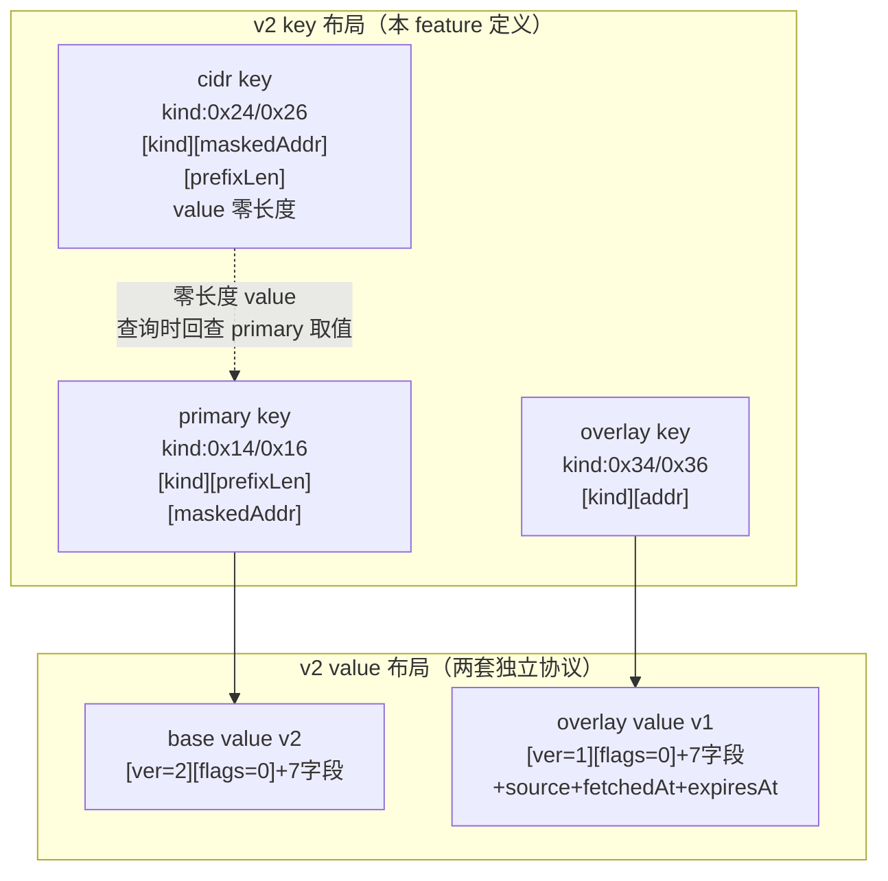

# ipdb-v2-schema design

## 0. 术语约定

所有新符号已 grep 全仓（代码 + 架构 + 历史 feature），仅在 roadmap/decision 文档出现，**无代码冲突**。v1 的 `keyFamily*` 前缀字节（0x04/0x06）与 v2 新 kind 字节（0x14/0x16/0x24/0x26/0x34/0x36）数值不重叠。

| 术语 | 定义 | 防冲突结论 |
|---|---|---|
| **kind 字节**（v2） | v2 key 的首字节，区分索引类型；常量命名 `keyKind*`（与 v1 `keyFamily*` 前缀语义区分） | v1 无 `keyKind` 符号，新增无冲突 |
| `primaryV4/V6` = 0x14/0x16 | LPM 主索引 kind；key = `[kind][prefixLen:1B][maskedAddr]` | 与 v1 `keyFamilyIPv4=0x04` 不重叠 |
| `cidrV4/V6` = 0x24/0x26 | CIDR 二级索引 kind；key = `[kind][maskedAddr][prefixLen:1B]`，**value 零长度** | 无冲突 |
| `overlayV4/V6` = 0x34/0x36 | overlay 缓存 kind；key = `[kind][addr]`，只存 /32 /128 | 无冲突 |
| `SchemaFeatures` (uint32) | capability 位，标识 base 库具备哪些索引能力 | 无冲突 |
| `base value v2` | base 库的 value 协议，版本字节 = 2 | 与 v1 value（版本 1）并存 |
| `overlay value v1` | overlay 缓存的 value 协议，版本字节 = 1（独立协议，与 base value 不共用 flag） | "v1"指 overlay value 自身首版，非 ipdb 全局 v1 |
| `OverlayMeta` | 单条 overlay record 的元信息（Source/FetchedAt/ExpiresAt），进 value | 与 `OverlayMetadata`（库级 JSON 元信息，属 ipdb-overlay-store）不同，本 feature 不定义后者 |

## 1. 决策与约束

### 需求摘要

- **做什么**：为 ipdb v2 定义 key/value 二进制编解码协议 + capability 位。primary 索引按 prefixLen 组织（支撑真 LPM ladder），cidr 二级索引按起始地址组织（支撑区间扫描，零长度 value），overlay 按 addr 组织。base value v2 与 overlay value v1 是两套独立协议。
- **为谁**：roadmap 后续 `ipdb-v2-base-build` / `ipdb-overlay-store` 的共同地基（模块 B/C 依赖此层）。
- **成功标准**：v1 codec 全量回归单测仍绿；v2 codec 单测覆盖正常 round-trip + 异常输入矩阵；capability 位与两套 value 协议定义就绪，可供下游 feature 直接调用。
- **明确不做**：
  - 不改 `currentFormatVersion`（仍为 1，留给 `ipdb-v2-query` 收口原子切换）
  - 不写任何存储/查询逻辑（builder/store/overlay 一律不动）
  - 不定义 `OverlayMetadata`（库级 JSON 元信息，属 `ipdb-overlay-store`）
  - 不实现 TTL 默认值（§4.5 约定在 integration 层）
  - 不定义/使用 `ErrDuplicatePrefix` / `ErrCorruptIndex` / `ErrLegacyFormat` / `ErrIncompleteSchema`（这些错误的**使用**归后续 feature；本 feature 只定义 capability 位和 codec 函数）

### 复杂度档位

走默认档位（库编码层 / 纯函数 / 无并发 / 无 IO），无偏离。

### 关键决策

每条换种做法会让名词层变得不同：

1. **key 布局把 prefixLen 编进 primary key**（`[kind][prefixLen][addr]`），不再像 v1 只编 masked 起始地址。→ 换回 v1 布局则 primary 索引无法做逐前缀长度精确 ladder，退化回 SeekGE 近似 LPM（正是 issue `2026-06-20-ipdb-writeback-breaks-lpm` 的根因）。
2. **cidr 二级索引零长度 value**，canonical value 只在 primary，cidr 查询回查 primary 取值。→ 换成"cidr 内联整份 value"则双份存储 + 双索引同步演进负担（见 decision `ipdb-cidr-index-empty-value`，已否决）。
3. **base value v2 与 overlay value v1 拆两套独立协议**，各自有 version/flags，不共用 `flagOverlayMeta`。→ 换成共用 flag 则两套协议被迫耦合演进。
4. **v1/v2 codec 并存**，v2 函数显式 `…V2` 后缀，v1 函数签名零 diff。→ 换成直接改 v1 会破坏现有 v1 库读路径（store.go 仍在用 v1）。
5. **encode 入参必须已 `Masked()`**（调用方保证），未 Masked 返回 error。→ 换成 codec 内部 Mask 会掩盖调用方 bug，且 primary/cidr 互相还原不变量会失效。
6. **decode 校验 flags==0**（base/overlay value 均校验），非 0 返回 error。对应 §7 "unknown flags" 验收项；roadmap 未写死，本 design 拍板校验，理由：未来 flags 可能扩展，当前非 0 即数据损坏或用错 decoder。
7. **Record.Network 不进 value**，decode 返回的 `Network` 为空字符串，回填责任在 Store（后续 feature）。→ 换成 value 里存 Network 则与 key 的 prefix 信息重复。

### 前置依赖

无（schema 是 roadmap 第一条，`depends_on: []`）。

## 2. 名词与编排

### 2.1 名词层

#### 现状

| 符号 | 位置 | 职责 |
|---|---|---|
| `keyFamilyMeta/IPv4/IPv6` | `types.go:6-8` | v1 key 首字节常量（0x00/0x04/0x06） |
| `currentFormatVersion = 1` | `types.go:10` | v1 库版本常量，**本 feature 不改** |
| `Record` | `types.go:20-29` | 8 字段（Network + 7 业务字段） |
| `Metadata` | `types.go:39-49` | 库级 JSON 元信息（FormatVersion int 等） |
| `encodePrefixKey/encodeAddrKey/decodeKeyAddr/boundsForAddr` | `codec.go:12-72` | v1 key 编解码（只编 masked 地址） |
| `encodeRecordValue/decodeRecordValue` | `codec.go:75-147` | v1 value 编解码：`[ver=1][prefixLen:1B] + 7字段`，prefixLen **在 value 里**；decode 带 startAddr 参数回填 `Record.Network` |

#### 变化

**`types.go`（新增，不改现有）**：

- kind 字节常量（`keyKind*` 前缀，与 v1 `keyFamily*` 区分）：`keyKindPrimaryV4=0x14` / `keyKindPrimaryV6=0x16` / `keyKindCIDRV4=0x24` / `keyKindCIDRV6=0x26` / `keyKindOverlayV4=0x34` / `keyKindOverlayV6=0x36`；meta 沿用 `keyFamilyMeta=0x00` 不新增
- `type SchemaFeatures uint32` + capability 常量：`SchemaFeaturePrimaryLPM = 1<<0`、`SchemaFeatureCIDRStartIdx = 1<<1`、预留 `SchemaFeatureCIDRInlineValue = 1<<2`（注释标预留，本 feature 不使用）
- `Metadata.SchemaFeatures SchemaFeatures`（JSON tag `schema_features,omitempty`：避免 v1 `BuildFromCSV` 的 `json.Marshal(meta)` 开始给新构建的 v1 库 metadata 写 `schema_features:0`，与"v1 保持不动 / 无对外行为变化"口径一致）；v1 旧库 JSON 无此字段，反序列化为零值 0 = 无 v2 capability，与 `OpenCurrentBase` 在 query 阶段的 `ErrIncompleteSchema` 判断天然一致
- `type OverlayMeta struct { Source string; FetchedAt time.Time; ExpiresAt time.Time }`（`ExpiresAt` 零值 = 永不过期）

**`codec.go`（新增 10 个 codec 函数，v1 全部不动）**：

key 编解码（6 个）：

```go
func encodePrimaryKeyV2(p netip.Prefix) ([]byte, error)   // [kind][prefixLen][maskedAddr]
func decodePrimaryKeyV2(key []byte) (netip.Prefix, error)
func encodeCIDRKeyV2(p netip.Prefix) ([]byte, error)       // [kind][maskedAddr][prefixLen]，codec 只产 key，value 零长度由 Store 层处理
func decodeCIDRKeyV2(key []byte) (netip.Prefix, error)
func encodeOverlayKeyV2(a netip.Addr) ([]byte, error)      // [kind][addr]
func decodeOverlayKeyV2(key []byte) (netip.Addr, error)
// 来源：本 feature 新增 backend/ipdb/codec.go
```

value 编解码（4 个 + OverlayMeta 已在 types.go 定义）：

```go
func encodeBaseRecordValueV2(rec Record) ([]byte, error)           // [ver=2][flags=0] + 7字段（不含 Network）
func decodeBaseRecordValueV2(value []byte) (Record, error)         // 返回 Record.Network="" ；不带 startAddr（与 v1 decodeRecordValue 签名不同）
func encodeOverlayRecordValueV1(rec Record, meta OverlayMeta) ([]byte, error)  // [ver=1][flags=0] + 7字段 + source + fetchedAt + expiresAt
func decodeOverlayRecordValueV1(value []byte) (Record, OverlayMeta, error)
// 来源：本 feature 新增 backend/ipdb/codec.go
```

**不改**：`Record` / `Match` / `Metadata` 已有字段、v1 全部 6 个 codec 函数、`currentFormatVersion`。

#### 接口示例

**key round-trip**（primary ↔ cidr 互相还原同一 prefix 是核心不变量）：

```
输入：netip.MustParsePrefix("10.1.0.0/16")
encodePrimaryKeyV2 → [0x14][0x10][0a 01 00 00]            // kind|prefixLen|addr
encodeCIDRKeyV2    → [0x24][0a 01 00 00][0x10]            // kind|addr|prefixLen
decodePrimaryKeyV2(encodePrimaryKeyV2(p))   == p          // ✅
decodeCIDRKeyV2(encodeCIDRKeyV2(p))         == p          // ✅
decodeCIDRKeyV2(encodeCIDRKeyV2(p)) 与 decodePrimaryKeyV2(encodePrimaryKeyV2(p)) 还原出同一 Prefix  // ✅
```

**base value round-trip**（Network 不进 value）：

```
输入：Record{Country:"AU", CountryCode:"AU", ASN:"AS13335", ...}  (Network 任意，encode 时忽略)
encodeBaseRecordValueV2 → [0x02][0x00][uvarint len|UTF-8]×7
decodeBaseRecordValueV2 → Record{Network:"", Country:"AU", ..., ASDomain:"..."}  // Network 为空
```

**overlay value round-trip**（含 OverlayMeta，expiresAtUnix==0 永不过期）：

```
输入：Record{...}, OverlayMeta{Source:"ipinfo", FetchedAt:t1, ExpiresAt:time.Time{}}  // 零值=永不过期
encodeOverlayRecordValueV1 → [0x01][0x00][7字段][uvarint sourceLen|"ipinfo"][int64 BE fetchedAt][int64 BE 0]
decodeOverlayRecordValueV1 → (Record{Network:""}, OverlayMeta{Source:"ipinfo", FetchedAt:t1, ExpiresAt:零值}, nil)  // ✅ 永不过期
```

**主要错误路径**（均有明确 error 文案）：

```
encodePrimaryKeyV2(netip.MustParsePrefix("10.1.2.3/16"))          → error "prefix 未 Masked"（addr 10.1.2.3 ≠ masked.Addr 10.1.0.0）
encodeCIDRKeyV2(netip.PrefixFrom(netip.MustParseAddr("10.1.0.0"), 33))  → error "prefixLen 越界: 33"（PrefixFrom 不 panic，返回 invalid Prefix；codec 必须识别 Bits()==-1 为越界）
decodeBaseRecordValueV2([0x03, 0x00, ...])                         → error "base value 版本不符: 3"（不静默）
decodeBaseRecordValueV2([0x02, 0x01, ...])                         → error "flags 非零: 1"（unknown flags）
```

### 2.2 编排层

本 feature 是**纯编码层**，无主流程编排、无 workflow、无 store/builder 改动。v2 函数定义出来但**本 feature 阶段无任何调用方**（builder/store 在后续 feature 切换）——这是 schema 作为"地基"的本意。

#### v2 codec 三套 key + 两套 value 协议关系



#### 现状

v1 codec 被 `builder.go`（写：`encodePrefixKey` + `encodeRecordValue`）和 `store.go`（读：`LookupIP`/`LookupCIDR`/`WriteRecord` 全路径）直接调用。v1 value 把 prefixLen 编进 value，单 IP 查询靠 SeekGE 近似 LPM。

#### 变化

v2 codec 作为**独立新增层**存在，本 feature 阶段**无调用方接入**（虚线）。`ipdb-v2-base-build` 起 builder 才调 v2 encode，`ipdb-v2-query` 起 store 才调 v2 decode。拓扑不变（仍线性）。

#### 流程级约束（codec 层契约，下游 feature 必须遵守）

- **encode 前置条件**：`encodePrimaryKeyV2` / `encodeCIDRKeyV2` 入参必须已 `Masked()`，否则 error（调用方保证，codec 不内部 Mask）
- **prefixLen 边界**：单字节，IPv4 取值 0–32 / IPv6 取值 0–128，越界返回 error
- **key 长度严格**：decode 时 key 长度必须精确匹配（primary V4 = 6B / V6 = 18B；cidr V4 = 6B / V6 = 18B；overlay V4 = 5B / V6 = 17B），截断或多余字节返回 error
- **value version/flags 校验**：decode 校验 version 字节（base=2 / overlay=1）与 flags==0，不符返回 error；含义是"库内部损坏 / 用错 decoder"，**不用于识别 v1**（库级 v1/v2 识别只依赖 `Metadata.FormatVersion`，归 query 阶段）
- **value 尾部严格**：decode 消费完所有字节后不得有剩余，多余尾部字节返回 error（防部分写 / 版本串台）
- **primary ↔ cidr 互相还原不变量**：同一 prefix 经两套 key 编码再解码，必须还原出同一个 `netip.Prefix`（下游 builder 同 batch 双写的前提）
- **Record.Network 回填责任**：decode 返回的 `Network` 为空字符串，由 Store（后续 feature）据 key 的 prefix 回填
- **expiresAtUnix==0 永不过期**：overlay value 的 `expiresAtUnix` 编码零值用整型 0，**不得用 `time.Time{}.Unix()`**（后者非 0）

### 2.3 挂载点清单

**本 feature 不引入新挂入点**。判据：删掉这些 codec 函数，feature 在用户/系统视角是否消失？——本 feature 阶段函数尚无调用方，对用户/系统完全不可见，故无挂入点。下游 feature（base-build/query/overlay-store）接入时才产生挂载点（builder 写库、store 查询、overlay Put），归各 feature 自挂载点清单。

### 2.4 推进策略

纯编码层无编排骨架（无 workflow），直接按计算节点切片：

1. **types.go 类型层**：新增 kind 字节常量 + `SchemaFeatures` 类型 + capability 常量 + `Metadata.SchemaFeatures` 字段 + `OverlayMeta` 类型
   退出信号：`go build ./...` 通过 + v1 全量单测仍绿（`go test ./backend/ipdb/...`）+ `currentFormatVersion` grep 仍为 1
2. **codec.go key 编解码**：新增 6 个 V2 key 函数（primary/cidr/overlay × 编/解码）
   退出信号：单测覆盖 round-trip（V4/V6、/0 与 /32 与 /128 边界）+ primary↔cidr 互相还原不变量 + 异常（未 Masked / prefixLen 越界 / key 长度非法 / kind 字节未知）
3. **codec.go value 编解码**：新增 base value v2（编/解码）+ overlay value v1（编/解码）
   退出信号：单测覆盖 round-trip（全字段 / 空字段 / Network 返回空）+ overlay OverlayMeta round-trip（含 expiresAtUnix==0 永不过期）+ 异常矩阵（version 不符 / flags 非零 / 截断 uvarint / 多余尾部字节）
4. **测试覆盖收口**：补齐 roadmap §7 schema 验收异常输入矩阵
   退出信号：所有第 3 节验收场景均有可观察证据

### 2.5 结构健康度与微重构

评估前已查 compound（关键词"目录组织 / 命名 / 归属"，category=convention），无命中 convention。

##### 评估

- **文件级 — `backend/ipdb/types.go`**：当前 57 行；本次新增 kind 常量 + `SchemaFeatures` + `Metadata` 一字段 + `OverlayMeta`，约 +25 行 → 约 82 行。职责单一（类型定义），改动密度低（同职责扩展）。健康。
- **文件级 — `backend/ipdb/codec.go`**：当前 147 行；本次新增 10 个 codec 函数，约 +180 行 → 约 330 行。v1 + v2 两套 codec 混在同一文件。改动密度高（10 个函数），但属同一职责（key/value 编解码）的两个版本，非两个不相关概念。行数接近但不超 500。
- **文件级 — `backend/ipdb/codec_test.go`**：当前 113 行（v1 测试）。23 条验收场景（含异常输入矩阵）预计再 +200~250 行 → 若并入 `codec_test.go` 约 330 行。倾向 **v2 测试单独落 `codec_v2_test.go`**（同 package、同 import 路径，编译器绿灯），让 v1/v2 测试边界清晰，且与"v1 全量回归保护"语义对齐。
- **目录级 — `backend/ipdb/`**：现有 5 个文件（codec/types/builder/store/codec_test），本次生产代码不新增文件、测试新增 1 个 `codec_v2_test.go` → 6 个文件。不摊平。

##### 结论：不做（生产代码微重构）；测试代码采纳新增 `codec_v2_test.go`

- `types.go` 健康（<100 行、单一职责）
- `codec.go` 加完约 330 行、v1+v2 同职责，不触发"混了 2 个以上不相关概念"触发器；v1/v2 并存是过渡态（query 收口后 v1 读路径仍保留一段时期），现拆 `codec_v1.go`/`codec_v2.go` 是 implement 阶段的代码组织选择，design 不强制
- 目录不挤
- **测试文件**：23 条验收场景体量大，**建议 implement 阶段新增 `codec_v2_test.go`**（同 package，纯新文件，无 import 改动，编译器绿灯）。这不是生产代码微重构，是测试组织选择，落进 checklist 推进步骤提示。

##### 超出范围的观察（仅提示不阻塞）

- `backend/ipdb/codec.go`：若后续 base-build/query 阶段继续往里加 v2 调用辅助函数导致超 500 行，建议届时走 `cs-refactor` 把 v2 codec 拆到 `codec_v2.go`（纯文件移动 + import 路径不变，编译器绿灯）。v1/v2 并存是过渡态，"v2 独立文件"不构成稳定 convention，不在此沉淀。本 feature 不动。

## 3. 验收契约

### 关键场景清单

**正常路径**（对应成功标准）：

1. v1 codec 全量单测仍绿（`TestEncodePrefixKeyRoundTrip` / `TestEncodeRecordValueRoundTrip` / `TestEncodeRecordValueWithEmptyFields`）——回归保护
2. `encodePrimaryKeyV2` / `decodePrimaryKeyV2` round-trip：V4（/0、/8、/16、/24、/32）+ V6（/0、/48、/128）各 prefixLen 边界
3. `encodeCIDRKeyV2` / `decodeCIDRKeyV2` round-trip：同上边界
4. `encodeOverlayKeyV2` / `decodeOverlayKeyV2` round-trip：V4 / V6 单 IP
5. **primary ↔ cidr 互相还原不变量**：同一 prefix 经两套 key 编码再解码，还原出同一 `netip.Prefix`（覆盖 V4/V6 + 多种 prefixLen）
6. `encodeBaseRecordValueV2` / `decodeBaseRecordValueV2` round-trip：全字段记录 + 全空字段记录
7. `decodeBaseRecordValueV2` 返回的 `Record.Network == ""`（Network 不进 value）
8. `encodeOverlayRecordValueV1` / `decodeOverlayRecordValueV1` round-trip：含 `OverlayMeta`（Source 非空 / Source 空）
9. **`expiresAtUnix==0` 永不过期**：`OverlayMeta{ExpiresAt: time.Time{}}` 编码后 `expiresAtUnix` 为整型 0，decode 还原回零值；`FetchedAt` 非零时间 round-trip 精确

**边界**：

10. `/0` 网段（prefixLen=0）primary/cidr key round-trip 正确
11. `/32`（IPv4）/ `/128`（IPv6）primary/cidr key round-trip 正确
12. overlay value 全 7 业务字段为空字符串时编解码正确

**错误路径**（异常输入矩阵，覆盖 roadmap §7）：

13. `encodePrimaryKeyV2` / `encodeCIDRKeyV2` 入参未 `Masked()`（如 `10.1.2.3/16`）→ 返回明确 error
14. prefixLen 越界：`netip.PrefixFrom(V4 addr, 33)` / `netip.PrefixFrom(V6 addr, 129)`（`PrefixFrom` 不 panic、返回 `Bits()==-1` 的 invalid Prefix，codec 必须识别为越界）→ 返回明确 error
15. decode key 长度非法（截断 / 多余字节）→ 返回明确 error
16. decode key 首字节（kind）未知（如 0x99）→ 返回明确 error
17. `decodeBaseRecordValueV2` version 字节 ≠ 2 → 返回明确 error
18. `decodeBaseRecordValueV2` flags 字节 ≠ 0（unknown flags）→ 返回明确 error
19. `decodeBaseRecordValueV2` 字段长度 uvarint 截断 → 返回明确 error
20. `decodeBaseRecordValueV2` 消费完后有多余尾部字节 → 返回明确 error
21. `decodeOverlayRecordValueV1` version 字节 ≠ 1 → 返回明确 error
22. `decodeOverlayRecordValueV1` flags 非 0 / 截断 / 多余尾部 → 返回明确 error
23. `Metadata.SchemaFeatures` capability 位组合：`SchemaFeaturePrimaryLPM | SchemaFeatureCIDRStartIdx` 可正确表示（位运算）
24. **`schema_features` JSON tag 行为**：`Metadata{SchemaFeatures:0}` 经 `json.Marshal` 输出**不含** `schema_features` 字段（`omitempty` 生效，v1 库 metadata 行为不变）；旧 JSON（无 `schema_features`）反序列化得零值 0；`SchemaFeatures` 非零（如 `SchemaFeaturePrimaryLPM`）marshal 正常输出字段

### 明确不做的反向核对项

- `grep -n "currentFormatVersion" backend/ipdb/types.go` 仍为 `currentFormatVersion byte = 1`（未改版本常量）
- v1 codec 函数签名零 diff：`grep` 确认 `encodePrefixKey` / `encodeAddrKey` / `decodeKeyAddr` / `boundsForAddr` / `encodeRecordValue` / `decodeRecordValue` 签名不变
- `git diff backend/ipdb/builder.go backend/ipdb/store.go` 为空（无存储/查询逻辑改动）
- 代码中不应出现 `OverlayMetadata` 类型定义（库级元信息留给 `ipdb-overlay-store`）
- 代码中不应出现 `ErrDuplicatePrefix` / `ErrCorruptIndex` / `ErrLegacyFormat` / `ErrIncompleteSchema` 的定义或使用（归后续 feature）
- codec 函数中不应出现 TTL 默认值常量（TTL 默认值在 integration 层）

### 质量门（项目硬约束，来源 `.codestable/attention.md`）

Go 改动后必须跑全 `go vet ./...` + `gofmt -l` + `git diff --check` 三件套，任一不过不准合并（issue `2026-06-20-nondeterministic-result-order` 的 CR-001 教训：只跑 `go test` 漏掉 `go vet` 导致 copylocks 进主干）。本 feature 基线 `go test ./backend/ipdb/...` 已绿，作为回归保护起点。

## 4. 与项目级架构文档的关系

本 feature 改动局限在 `backend/ipdb` 编码层**内部**，v2 codec 尚无调用方，**无系统级可见变化**。acceptance 核实后跳过 architecture 归并。

- 新 kind 字节（0x14/0x16/0x24/0x26/0x34/0x36）是模块内部协议细节，`ip-lookup.md` §3"Key 编码"仍是 v1 描述（0x04/0x06），本 feature 不改 arch——与 roadmap §8 观察项一致，留给 `ipdb-lookup-integration` 的 `cs-feat-accept` 统一回写
- `SchemaFeatures` capability 是 base 库内部契约，待 `OpenCurrentBase`（query 阶段）对外暴露错误时才系统级可见，届时再回写 arch"已知约束"
