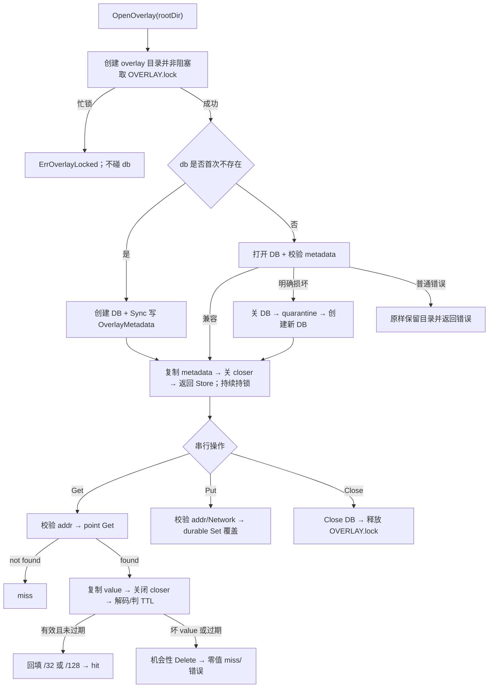

# ipdb-overlay-store design

## 0. 术语约定

已 grep 代码、架构、roadmap、历史 feature 与 compound：当前代码没有 `OverlayStore` / `OpenOverlay` / `ErrOverlayLocked` / `ErrOverlayClosed`，可直接使用；历史文档里的概念名 `PutOverlay` 不再沿用，当前硬契约统一为方法 `OverlayStore.Put`。

| 术语 | 定义 | 防冲突结论 |
|---|---|---|
| base | CSV 构建、按版本发布、运行期只读的离线 IP 库 | 现有 `BaseStore`；本 feature 不改 |
| overlay | `ipinfo` 单 IP 结果的独立 Pebble 缓存，固定落在 `ipdb/overlay/db` | 新增 `OverlayStore`，不并入 `Store` / base keyspace |
| `OverlayMeta` | 单条记录级 metadata：`Source` / `FetchedAt` / `ExpiresAt`，随 overlay value 编码 | 已在 `backend/ipdb/types.go` 定义 |
| `OverlayMetadata` | overlay 库级 JSON metadata：格式版本与创建时间 | 新增；与记录级 `OverlayMeta` 严格区分 |
| 生命周期锁 | `overlay/OVERLAY.lock` 的非阻塞跨进程独占锁，从 `OpenOverlay` 持有到 `Close` | 不改变 base 的 `BUILD.lock` / `VERSIONS.lock` 阻塞语义 |
| quarantine | Open/metadata 校验阶段确认库级损坏时，把旧 `overlay/db` 隔离为唯一 sibling 后创建新库 | 只保留证据，不自动清理；运行期存储错误不触发 |
| 机会性删除 | `Get` 发现过期或损坏 value 时，在返回 miss 前尝试删除该 key | 不是定时清理、LRU 或容量治理 |

## 1. 决策与约束

### 需求摘要

- **做什么**：实现独立的 `OpenOverlay` / `Get` / `Put` / `Close`，包含库级 metadata/version、单 IP TTL、过期与坏记录自愈、损坏库 quarantine、跨进程 fail-fast 生命周期锁和进程内并发安全。
- **为谁**：为后续 `ipdb-lookup-integration` 提供可独立验证的后端存储能力；本 feature 本身不改变用户可见 CLI 行为。
- **成功标准**：IPv4/IPv6 可跨关闭重开 round-trip；TTL 边界确定；单条损坏不拖垮整库；库级损坏可保留证据后重建；锁冲突立即、无损失败；base 重建不影响 overlay。
- **明确不做**：
  - 不改 `App` / `internal/cli`，不查询 overlay，不恢复 live 回写，不实现三来源选择；
  - 不设默认 TTL，不改 `data_source_priority`，不引入异步队列；
  - 不改 `Store` / `BaseStore` / `OpenCurrent` / `WriteRecord`，不向 base 写数据；
  - 不存 CIDR、不做 LPM，只接受单 IP 对应的 `/32` / `/128`；
  - 不做 quarantine 清理、overlay clear 命令、容量上限或 LRU；
  - 不支持多进程共享读写；只允许一个 `OverlayStore` owner，其余进程立即失败；
  - 不在本 feature 回写仍描述旧编排的 `architecture/ip-lookup.md`，统一留给 integration 收口。

### 复杂度档位

- **健壮性 = L3**：磁盘状态、锁、rename 和关闭顺序均需明确错误语义，任何不确定错误不得删除用户数据。
- **结构 = modules**：overlay 存储自成职责单元，只复用既有 codec 与跨平台文件锁能力。
- **可测试性 = verified**：TTL、锁、quarantine、幂等覆盖与 base 物理隔离都属于持久化不变量。
- **Concurrency = thread-safe + process-exclusive fail-fast**：同一句柄内串行化 `Get` / `Put` / `Close`；跨进程不共享句柄或目录。
- **Idempotency = idempotent last-write-wins**：同一 IP 重复 `Put` 覆盖为最后一次完整值。

### 关键决策

用户已确认“backend-only，CLI 接线留给 integration”的 feature 边界。roadmap 未逐项拍板的实现语义先按下列**建议假设**起草；本轮整体批准即表示确认这些默认值，任何一项都可在批准前调整：

| 待确认项 | 本草案采用（推荐） | 备选及代价 |
|---|---|---|
| metadata 的零 `CreatedAt` | 视为不完整 metadata，quarantine | 接受：兼容更宽，但失去创建时间不变量 |
| 机会性删除失败 | 返回 miss + error，不返回陈旧值 | 吞掉删除错误：调用简单，但磁盘故障不可见 |
| Put durability | `Put` 成功即 durable Sync | NoSync：更快，但 CLI 退出可能丢最近写入 |
| 输入一致性 | 非空 Network 必须匹配 addr；拒绝保留值 Unix 0 的非零 ExpiresAt | 静默忽略/归一化：兼容更宽，但掩盖 key/value 与永不过期语义错误 |
| 句柄生命周期 | Get/Put/Close 串行；稳定 `ErrOverlayClosed`；Close 幂等 | 要求调用方自行串行：代码更少，但存在误删新值与 close 竞态 |

1. **overlay 使用独立目录、独立库级 metadata/version**。`overlayFormatVersion` 初始为 1，`OverlayMetadata{FormatVersion, CreatedAt}` 存在既有 `metadataKey`；base 构建与版本回收永不扫描 `overlay/`。不复用 base `Metadata`，否则两套生命周期会再次耦合。
2. **在 Pebble 锁之外增加非阻塞生命周期锁**。`OpenOverlay` 在打开、隔离或重建 `overlay/db` 前取得 `overlay/OVERLAY.lock`，持有到 `Close`；忙锁返回可被 `errors.Is` 判定的 `ErrOverlayLocked`。仅依赖 Pebble `LOCK` 会在“关库后、rename 前”留下另一进程抢先打开的竞态；持 Pebble 句柄直接 rename 又不具备跨平台安全性。
3. **只在 Open/metadata 校验阶段对可确认损坏做 quarantine**。既有 DB 的 metadata 缺失、坏 JSON、版本不等于 1、`CreatedAt` 为零，或 `pebble.Open` / metadata Get 明确返回 corruption，才隔离旧 `db`；权限、普通 I/O、lock/open 等其它错误直接返回且不 rename/delete。首次不存在的 `db` 直接创建，不把“新库尚无 metadata”误判为损坏。运行期 Get/Put 的 Pebble corruption 只返回错误，由调用方关闭并降级，不做活句柄内重建或自动重试。
4. **quarantine 保留证据且名称不冲突**。metadata value 先复制为自有字节；所有已取得的 closer/DB 都必须成功关闭，任一关闭失败都保留原目录并返回错误。随后继续持有外层锁，把 `db` rename 为 Windows-safe 的 `quarantine-{yyyyMMddTHHmmss.nnnnnnnnnZ}-{suffix}`，再创建新 `db`；rename 失败保留原库，新库创建失败也保留 quarantine。本 feature 不做自动清理。
5. **`Get` 把 key 当作 Network 真相来源**。value codec 不保存 `Record.Network`；命中后按 addr 回填规范 `/32` 或 `/128`。过期定义固定为 `!ExpiresAt.IsZero() && !now.Before(ExpiresAt)`，因此 `now == ExpiresAt` 已过期；零值永不过期。
6. **过期与单条 value 损坏均自愈为 miss**。在 closer 有效期内把 value 复制为自有字节，成功关闭 closer 后再解码、判断 TTL 和机会性删除；删除成功返回 `Record{}, OverlayMeta{}, false, nil`，删除失败返回两个零值、`false` 加错误，绝不返回陈旧或半解码数据。not found 同样返回两个零值、`false, nil`。显式 `now` 是 TTL 判断的唯一时钟输入。
7. **`Put` 成功具有同步持久化语义**。使用 durable write；同 IP last-write-wins。`addr` 拒绝 invalid / IPv4-mapped IPv6 / 带 zone 的 IPv6；`Record.Network` 可空，非空时必须能解析为与 addr 相同的 host prefix。Store 不补默认 TTL、不校验 `ExpiresAt > FetchedAt`；但非零 `ExpiresAt` 若编码后落入保留值 Unix 0，必须拒绝，避免被误读成“永不过期”。
8. **时间协议保持 schema 已定的 Unix 秒精度**。`FetchedAt` / 非零 `ExpiresAt` round-trip 后统一为 UTC 秒精度；调用方传入的亚秒会被截断。TTL 比较针对磁盘解码后的值，不在 Store 内悄悄调用 `time.Now()`。
9. **句柄内串行化生命周期**。`Get` / `Put` / `Close` 共用互斥边界，避免“Get 读到旧过期值 → 并发 Put 新值 → Get 删除新值”，也避免 `Close` 与 Pebble 方法并发。`Close` 先关 DB、再释放外层锁；nil / 重复 Close 返回 nil，关闭后 `Get` / `Put` 返回 `ErrOverlayClosed` 而不是 panic。

### 前置依赖

`ipdb-v2-schema` 已 done：overlay key v2、overlay value v1、`OverlayMeta` 和 IPv4-mapped IPv6 拒绝规则均已落地。现有跨平台 `fileLock` 是阻塞式；本 feature 只扩展非阻塞取得能力，base 原调用语义保持不变。

## 2. 名词与编排

### 2.1 名词层

#### 现状

- `backend/ipdb/types.go` 已有记录实体 `Record` 与记录级 `OverlayMeta`。
- `backend/ipdb/codec.go` 已有 package-private 的 `encode/decodeOverlayKeyV2` 和 `encode/decodeOverlayRecordValueV1`；value 明确不存 `Record.Network`，时间为 Unix 秒。
- `backend/ipdb/file_lock_{unix,windows,unsupported}.go` 已封装阻塞式跨进程锁，供 base 构建和版本生命周期使用。
- 当前没有 overlay 库级 metadata、存储句柄或打开入口；overlay codec 尚无运行期调用方。

#### 变化

新增以下 backend 契约，且不聚合进过渡壳 `Store`：

```go
const overlayFormatVersion = 1

type OverlayMetadata struct {
    FormatVersion int       `json:"format_version"`
    CreatedAt     time.Time `json:"created_at"`
}

var (
    ErrOverlayLocked = errors.New("overlay 已被其它进程占用")
    ErrOverlayClosed = errors.New("overlay 已关闭")
)

func OpenOverlay(rootDir string) (*OverlayStore, error)
func (o *OverlayStore) Get(addr netip.Addr, now time.Time) (Record, OverlayMeta, bool, error)
func (o *OverlayStore) Put(addr netip.Addr, rec Record, meta OverlayMeta) error
func (o *OverlayStore) Close() error
```

接口示例：

```go
// 来源：roadmap ipdb-v2-lpm §4.4；backend/ipdb OverlayStore
overlay, err := OpenOverlay(rootDir)
// 首次或兼容库：overlay != nil，err == nil

addr := netip.MustParseAddr("1.1.1.1")
err = overlay.Put(addr, Record{CountryCode: "US"}, OverlayMeta{
    Source: "ipinfo", ExpiresAt: time.Date(2026, 7, 16, 0, 0, 0, 0, time.UTC),
})
// err == nil；同 addr 再 Put 会完整覆盖旧值

err = overlay.Put(addr, Record{Network: "1.1.1.0/24"}, OverlayMeta{})
// err != nil；Network 与 addr 的 host prefix 不一致，不写入

rec, meta, hit, err := overlay.Get(addr, time.Date(2026, 7, 15, 23, 59, 59, 0, time.UTC))
// rec.Network == "1.1.1.1/32"，meta.Source == "ipinfo"，hit == true，err == nil

_, _, hit, err = overlay.Get(addr, time.Date(2026, 7, 16, 0, 0, 0, 0, time.UTC))
// hit == false，err == nil；等于 ExpiresAt 已过期并触发机会性删除

_, _, hit, err = overlay.Get(netip.MustParseAddr("8.8.8.8"), time.Time{})
// 不存在的 key：hit == false，err == nil

_, err = OpenOverlay(rootDir)
// 第一个 overlay 尚未 Close 时：errors.Is(err, ErrOverlayLocked) == true

err = overlay.Close()
err = overlay.Close()
// 两次均为 nil
_, _, _, err = overlay.Get(addr, time.Time{})
// errors.Is(err, ErrOverlayClosed) == true
```

### 2.2 编排层



#### 现状

当前查询编排只有 base 与 live；因历史止血，live 结果不会回写。overlay 的 key/value codec 仅是已验证协议，没有持久化 workflow。base 的锁负责 builder/reader 协调，不适合直接承担 overlay 的 fail-fast 生命周期。

#### 变化

- **Open workflow**：建立 overlay 容器目录 → 非阻塞独占锁 → 区分首次创建与既有库 → 用既有 `silentLogger` 打开 Pebble → 复制并关闭 metadata closer 后校验库级 metadata → 正常返回、无损报错或 quarantine 重建三选一。任何失败路径都先关闭已取得资源，再释放外层锁；关闭失败不得 rename。
- **Get workflow**：校验并编码 addr → point Get → 在 closer 有效期内复制 value → 关闭 closer → 解码、回填 Network 并判断 TTL；not found 直接返回零值 miss，过期/坏 value 仅在 closer 关闭后删除并返回零值 miss，其它存储错误返回零值 miss + error。
- **Put workflow**：校验 addr 与可选 Network → 编码完整 value → durable Set 覆盖同 IP。一次 Set 同时替换 Record 与 `OverlayMeta`，不存在部分更新。
- **Close workflow**：在互斥边界内把句柄标记关闭，先关闭 Pebble，再释放生命周期锁；两侧错误合并返回，后续调用稳定返回 closed sentinel。

#### 流程级约束

- **错误语义**：只有 `ErrOverlayLocked` / `ErrOverlayClosed` 是稳定 sentinel；非阻塞锁只把 Unix `EWOULDBLOCK/EAGAIN` 与 Windows `ERROR_LOCK_VIOLATION` 映射为 locked sentinel，其它锁/权限错误保持普通错误。输入、I/O、metadata、rename、close 错误均带上下文包装。自动 quarantine 成功后返回可用新 Store；失败时绝不删除旧证据。
- **锁顺序**：进程内 mutex → Pebble 操作；跨进程 `OVERLAY.lock` 从 Open 到 Close 独占。不得在释放外层锁后继续访问、rename 或清理 `db`。
- **幂等性**：重复 Put 同一 IP 不增加多条 key；重复 Close 无副作用；对同一坏/过期 key 的机会性删除可重复。
- **可观测性**：无法自动恢复的错误由调用方获得；成功隔离的旧库以唯一 quarantine 目录保留。backend 不输出 CLI warning，留给 integration 决定 stderr 行为。
- **扩展边界**：默认 TTL、优先级选择、live 请求和 warning 均位于 future integration；OverlayStore 只处理调用方给定的数据与时间。

### 2.3 挂载点清单

本 feature 没有 CLI route、配置 key、定时任务或用户输出挂入点，只有两个 backend 挂载点：

- `backend/ipdb` 公共契约：`OpenOverlay` 与 `OverlayStore.Get/Put/Close` — 新增，供后续 integration 消费。
- `~/.geoprism/ipdb/overlay/` 磁盘布局：`OVERLAY.lock`、`db`、quarantine sibling 与库内 `OverlayMetadata` — 新增。

移除这两个挂载点后，overlay 能力在系统视角完整消失；既有 schema codec 可独立保留，不属于本 feature 新挂入点。

### 2.4 推进策略

1. **生命周期骨架**：先跑通首次 Open、metadata 建立、Close 与非阻塞独占锁。
   退出信号：新目录可打开/关闭；第二 owner 立即得到稳定 locked 错误；base 锁测试仍保持原语义。
2. **损坏隔离编排**：补既有库校验、错误分类、唯一 quarantine 与 fresh DB 重建。
   退出信号：明确损坏可恢复，普通错误与忙锁均不移动原目录。
3. **记录读写节点**：接通 Put/Get、Network 回填、TTL 和坏 value 机会性删除。
   退出信号：IPv4/IPv6 round-trip、覆盖写和 TTL 边界独立可证。
4. **并发与持久化收口**：串行化 Get/Put/Close，锁死 durable Put、资源关闭与错误合并语义。
   退出信号：关闭竞态不 panic、不误删新值，Put 成功后跨重开仍可读。
5. **验收矩阵**：覆盖 corruption、lock、输入边界、base 重建隔离和范围守护。
   退出信号：第 3 节每条均有自动化证据，项目全量校验通过。

### 2.5 结构健康度与微重构

#### 评估

- compound convention 检索：围绕“目录组织 / 命名 / 归属”未命中既有 convention。
- 文件级 — 既有跨平台 `file_lock_*` 各 15–53 行、职责单一，只需增加非阻塞能力；`types.go` 的现有 `OverlayMeta` 与 581 行的 `codec.go` 均只被消费、不修改，库级 `OverlayMetadata` 跟随新 Store 归属，不再向胖 codec 塞存储逻辑。
- 目录级 — `backend/ipdb` 当前 17 个同层 Go 文件，本 feature 预计新增存储实现与测试后达到 19 个，触发“≥8 且新增 ≥2”的摊平观察；但 Go 的目录即 package，纯移动到子目录会改变 import path、可见性与 package-private codec 复用，不再是“只搬不改行为”。

#### 结论：不做微重构

本 feature 用独立 overlay 存储文件隔离新职责，小幅扩展既有锁抽象；不向胖 `codec.go` 继续堆逻辑。为解决目录摊平而拆 package 会改变模块边界与调用关系，超出安全微重构范围，收益不抵当前风险。

##### 超出范围的观察

- `backend/ipdb` 长期可评估按 codec / base / overlay 重划 package，但需先设计 package-private 协议的归属与兼容 API；建议未来有持续维护压力时走 `cs-refactor`，不阻塞本 feature。

## 3. 验收契约

### 关键场景清单

1. 首次对空 root 调 `OpenOverlay` → 创建 `overlay/OVERLAY.lock` 与 `overlay/db`，库级 metadata 为 version 1 且 `CreatedAt` 非零。
2. 分别 Put IPv4 / IPv6 后 Get、Close、reopen 再 Get → 业务字段与 `OverlayMeta` 保持，Network 分别回填规范 `/32` / `/128`，时间为 UTC 秒精度。
3. 同一 IP 连续 Put 两个不同值 → 只命中后一个完整 Record/Meta，不残留旧字段。
4. `now < ExpiresAt` → hit；`now == ExpiresAt` 与 `now > ExpiresAt` → miss 且 key 被机会性删除；零值 ExpiresAt 在任意未来 now 下仍 hit。过期删除失败时仍为 miss，但 error 非 nil。
5. value 被截断或写入错误版本 → Get 返回两个零值、miss、不 panic、删除坏 key；同库其它 IP 仍正常命中。若删除失败，仍返回两个零值与 miss，但 error 非 nil。
6. Open 既有库时分别出现 metadata 缺失、坏 JSON、错误版本、零 `CreatedAt`，或 Pebble open/metadata Get 明确 corruption → 旧 db 被移动到唯一且 Windows-safe 的 quarantine，新 db 可正常 Put/Get；连续两次隔离不覆盖历史证据。
7. metadata closer / DB 关闭失败、权限、普通 I/O、无法打开或 quarantine rename 失败 → 返回错误，原 db 不被删除或覆盖。运行期 Get/Put 的 Pebble corruption 同样只返回错误，不重建、不重试、不产生 quarantine。
8. 第一个 Store 持有锁时第二次 Open → 立即返回 `ErrOverlayLocked`，db 与 quarantine 集合不变；第一个 Close 后可重新打开。
9. metadata 已损坏且当前 DB/生命周期被另一 owner 锁住 → 新 Open 仍只返回 locked/open 错误，不执行 quarantine。
10. Close 两次 → 均安全；Close 后 Get/Put → `ErrOverlayClosed`；Get/Put/Close 并发 → 不 panic、不发生旧 Get 删除新 Put。
11. 对不存在的合法 IP 调 Get → 两个零值、`matched=false, err=nil`；对 invalid addr / IPv4-mapped IPv6 / 带 zone 的 IPv6 调 Get → 返回错误、不访问其它 key。
12. invalid addr、IPv4-mapped IPv6、带 zone 的 IPv6、与 addr 不同的非空 Network、非零但编码为 Unix 0 的 ExpiresAt → Put 失败且不产生 key；空 Network 或语义相同的规范 host prefix → 可写。
13. Put 返回成功后立即 Close/reopen → 记录仍存在，证明同步持久化语义。
14. overlay 保持打开且已有数据时执行一次 base 重建 → overlay 仍可 Get；重建完成并重开 overlay 后数据仍存在。
15. 支持的 Unix / Windows 构建保持可用；base 原阻塞锁语义不变，overlay 仅把各平台明确的 busy code 映射为 `ErrOverlayLocked`。

### 明确不做的反向核对项

- `internal/cli` 不应出现 diff；不新增 `App` overlay 字段、默认 TTL、live 回写或候选选择调用。
- `Store` / `BaseStore` / `OpenCurrent` / `WriteRecord` 的公开结构与行为不应改变；base keyspace 不应出现 overlay key。
- 不应新增 CIDR/LPM overlay API、清理命令、配置项、定时器、容量/LRU 逻辑或异步队列。
- CLI 文本/JSON/stdout/stderr 协议不应因本 feature 改变。
- `architecture/ARCHITECTURE.md` 与 `architecture/ip-lookup.md` 本 feature 不应出现 diff，统一留给 integration 收口。

## 4. 与项目级架构文档的关系

- 关联 `architecture/ip-lookup.md` 与 `architecture/ARCHITECTURE.md`。系统级最终需要记录：base/overlay 物理分离、`OverlayStore` 生命周期、TTL、自愈 quarantine、单 owner lock，以及 integration 对其降级。
- 当前架构文档仍包含旧 `WriteRecord` / 异步回写描述。按 roadmap §8，本 feature 只完成 backend 能力，不把尚未接线的 overlay 写成已生效用户路径；由 `ipdb-lookup-integration` acceptance 连同 `App` 双句柄和三来源流程一次性回写。
- 本 feature acceptance 只需确认上述延期仍成立，不提前修改 requirement 的用户可见行为或架构主流程。
